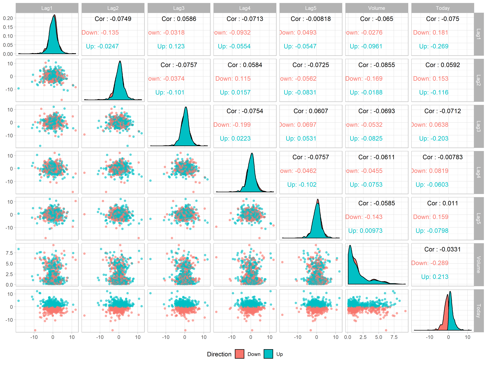
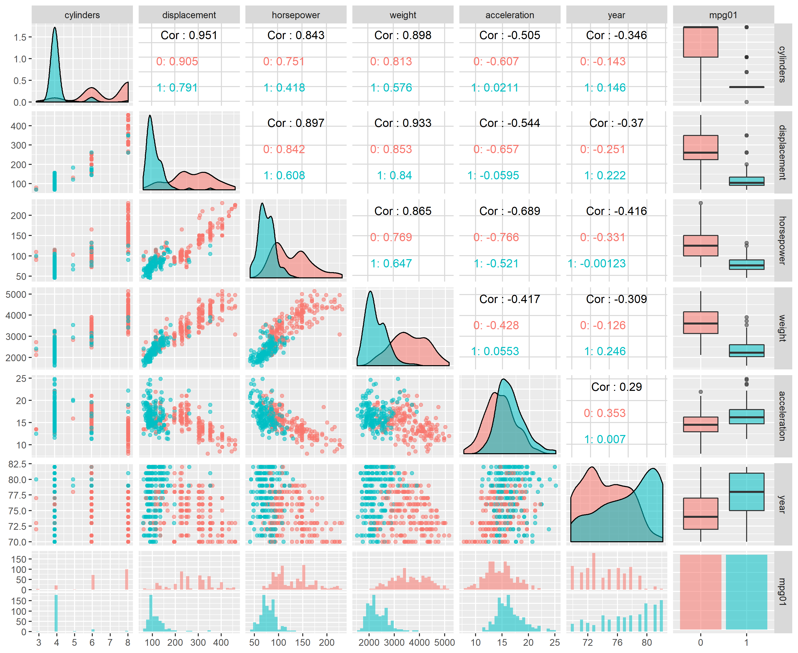

<style type="text/css">
.main-container {
  max-width: 1800px;
  margin-left: auto;
  margin-right: auto;
}
</style>

```{r setup, include=FALSE}
knitr::opts_chunk$set(echo = TRUE)
```


```{r, message=F, warning=F, results=F}
#Librerías
library(tidyverse) # Manipulación, limpieza y gráficos
library(ISLR) # Bases de datos
library(plotly) # Interactividad gráfica
library(ggthemes) # Presentación
library(GGally) # Correlación
library(yardstick) # Métricas
library(MASS) # Clasificadores
library(class) # Clasificadores
library(tree) #CART - ISLR
library(broom) # Resultados tidy de modelos
library(latex2exp) # Expresiones LaTex en las gráficas
library(randomForest) # Libreria para bosques aleatorios
library(gbm) # Boosting
library(pls) # Principal component regression
library(ggforce) # Características adicionales para ggplot
library(e1071) # Maquinas de soporte vectorial
library(caret) # Some models and plots
```


# Sección 4.7 -  Ejercicio 10


## a) Análisis descriptivo

El conjunto de datos `Weekly` contiene porcentajes de retorno semanales del índice S&P entre los años 1990 y 2010 con 1089 observaciones.

- `Year`: es el año en el que fue obtenida la observación.
- `Lag 1-5`: Retornos porcentuales de las 5 semanas anteriores, respectivamente.
- `Volume`: Volumen de acciones intercambiadas (Número promedio de acciones diarias intercambiadas en billones).
- `Today`: Retorno porcentual de la semana.
- `Direction`: Indica si el mercado tuvo un retorno positivo o negativo en esta semana.

Encabezados y primeras 6 observaciones:

```{r, message=F, warning=F}
weekly <- as_tibble(Weekly)
head((weekly))
```

### Volumen promedio de acciones diarias intercambiadas en el tiempo 

Se evidencia un crecimiento constante con un alza grande en el año 2005 y una estabilización de la trayectoria alrededor del año 2007. Se añadió un ruido a la posición de cada punto para poder evidenciar la densidad, además de transparencia. Se utilizó el método `mgcv::gam` para ajustar la tendencia. 

```{r, warning=F, message=F}
p <- weekly %>%
  ggplot(aes(x = Year, y = Volume)) +
  geom_jitter(alpha = 0.6) + 
  geom_smooth() +
  labs(x = NULL,
       y = "Volumen (Billones)") +
  theme_economist()

p_box <- weekly %>%
  ggplot(aes(x = as_factor(Year), y = Volume, color = Today)) +
  geom_boxplot() +
  theme_economist() +
  theme(axis.text.x = element_text(angle = 45)) +
  labs(x = NULL,
       y = "Volumen (Billones)")

ggplotly(p, width = 800, height = 500)
ggplotly(p_box, width = 800, height = 500)
```

El incremento en la volatilidad del índice acompañó su crecimiento a partir del 2007.

### Correlación entre las variables

No se encontraron relaciones lineales claras entre las variables. Se presentan comportamientos esperados de la variable `Today` con la variable categórica `Direction` representada en el color, donde los valores negativos están asociados a un decrecimiento.



```{r, echo=F, fig.width=12, fig.height=9, warning=F, message=F, include=F}
weekly %>% 
ggpairs(columns = 2:8, mapping = aes(color = Direction), legend = 1,
                lower = list(continuous = wrap("points", alpha = 0.6))) +
  theme_light() +
  theme(legend.position = "bottom")
```

## b) ¿Podemos predecir si el índice subirá o no mediante regresión logística?

Utilicemos regresión logística para predecir si habrá un retorno positivo del mercado en esta semana. Para ello, se utilizará el retorno porcentual de las 5 últimas semanas y el volumen sin separar un conjunto de entrenamiento y de prueba (Modelo sobreajustado).

```{r, message=F}
market_logistic <- glm(Direction ~ Lag1 + Lag2 + Lag3 + Lag4 + Lag5 + Volume, data = weekly, family = binomial)
summary(market_logistic)
```

Si realizamos una prueba de hipótesis formal para la significancia de los parámetros, encontraremos que la probabilidad de rechazar la hipótesis nula es muy grande para todas las variables predictoras excepto para el `Lag2` donde al parecer hay significancia. El valor en el tiempo $t-2$  parece tener una relación con el tiempo $t$.

### c) Matriz de confusión de la regresión logística y calidad de la predicción del modelo sobreajustado

```{r, fig.width=7, fig.height=4}
contrasts(as_factor(weekly$Direction))
market_logistic_class <- tibble(value = predict(market_logistic, type = "response"),
                                pred = fct_relevel(as_factor(case_when(value > 0.5 ~ "Up",
                                                  TRUE ~ "Down")), "Down", "Up"),
                                real = weekly$Direction)

market_logistic_class %>% 
conf_mat(truth = real, estimate = pred) %>% 
  autoplot(type = "heatmap") +
  labs(title = "Matriz de confusión para el modelo de regresión logística")

market_logistic_class %>% 
  metrics(truth = real, estimate = pred)
```

Se obtiene una tasa de clasificación correcta `accuracy` del 56.1% utilizando regresión logística. Es importante interpretar este resultado correctamente, ya que la predicción obtenida indica que el mercado subió 557 días y bajó 54 días, y que no se está prediciendo el valor en el tiempo $t+1$.

Cada predicción individual se debe interpretar de la siguiente manera: "Dadas las 5 semanas anteriores y el volumen de ésta, el mercado tendrá un retorno positivo". La mayor cantidad de errores se cometió prediciendo que el mercado iba a subir y en realidad bajó, esta situación ocurrió 430 veces.

## d) Modelo de regresión logística sólo con `Lag2` y conjunto de prueba

```{r, fig.width=7, fig.height=4}
weekly_train <- weekly %>% 
  filter(Year <= 2008)

weekly_test <- weekly %>% 
  filter(Year > 2008)

lag2_logistic <- glm(Direction ~ Lag2, data = weekly_train, family = "binomial")
summary(lag2_logistic)

lag2_class <- tibble(value = predict(lag2_logistic, type = "response", newdata = weekly_test),
                     pred = fct_relevel(as_factor(case_when(value > 0.5 ~ "Up",
                                                  TRUE ~ "Down")), "Down", "Up"),
                     real = weekly_test$Direction)

lag2_class %>% 
conf_mat(truth = real, estimate = pred) %>% 
  autoplot(type = "heatmap") + 
  labs(title = "Matriz de confusión para la regresión logística con Lag2 como único predictor")

lag2_class %>% 
  metrics(truth = real, estimate = pred)
```

Al igual que el modelo anterior, se tienen fallas al intentar predecir las bajas del mercado, sin embargo, este se validó en un conjunto de prueba de 104 observaciones desconocidas para el modelo. El `accuracy` en este caso es del 62.5%. Los resultados son sorpresivamente mejores que en el modelo sobreajustado del literal b).

## d) Modelo LDA (Linear Discriminant Analysis) para predecir la tendencia del mercado

```{r, fig.width=7, fig.height=4}
lag2_lda <- lda(Direction ~ Lag2, data = weekly_train)
lag2_lda

plot(lag2_lda)

lag2_lda_class <- tibble(pred = predict(lag2_lda, newdata = weekly_test)$class,
                         real = weekly_test$Direction)

lag2_lda_class %>% 
conf_mat(truth = real, estimate = pred) %>% 
  autoplot(type = "heatmap") + 
  labs(title = "Matriz de confusión para el modelo LDA con Lag2 como único predictor")

lag2_lda_class %>% 
  metrics(truth = real, estimate = pred)
```

Se obtienen las mismas clasificaciones para el modelo LDA y el modelo de regresión logística. Como el coeficiente discriminante lineal es `Lag2` = 0.4414, es de esperar que en ambas categorías la gráfica de éstos sea similar. La matriz de confusión es igual a la del modelo logístico.

## f) Modelo QDA (Quadratic Discriminant Analysis) para predecir la tendencia del mercado

```{r, fig.width=6, fig.height=4}
lag2_qda <- qda(Direction ~ Lag2, data = weekly_train)
lag2_qda

lag2_qda_class <- tibble(pred = predict(lag2_qda, newdata = weekly_test)$class,
                         real = weekly_test$Direction)

lag2_qda_class %>% 
conf_mat(truth = real, estimate = pred) %>% 
  autoplot(type = "heatmap") + 
  labs(title = "Matriz de confusión para el modelo QDA con Lag2 como único predictor")

lag2_qda_class %>% 
  metrics(truth = real, estimate = pred)
```

El clasificador QDA clasificó todos los valores como "Up", si bien es una estrategia que otorga resultados buenos en términos porcentuales con respecto al *accuracy*, se espera que el modelo proponga en algunos casos predicciones de baja del mercado. 

## g) Modelo KNN (K-Nearest Neighbors) para predecir la tendencia del mercado

```{r, fig.width=6, fig.height=4}
set.seed(1)
lag2_knn <- knn(train = as.matrix(weekly_train$Lag2), test = as.matrix(weekly_test$Lag2), cl = weekly_train$Direction, k = 3)


lag2_knn_class <- tibble(pred = lag2_knn,
                         real = weekly_test$Direction)

lag2_knn_class %>% 
conf_mat(truth = real, estimate = pred) %>% 
  autoplot(type = "heatmap") + 
  labs(title = "Matriz de confusión para el modelo KNN con Lag2 como único predictor")

lag2_knn_class %>% 
  metrics(truth = real, estimate = pred)
```

El clasificador $KNN$ tiene una tasa de clasificación correcta del 50% utilizando $k = 1$, sin embargo, al utilizar $k = 3$ se obtiene un 54.8%. Este clasificador no tuvo inconvenientes en proponer predicciones variadas según el valor anterior del mercado.

## h) ¿Qué métodos producen los mejores resultados para predecir la tendencia del mercado utilizando `Lag2`?

Los métodos de regresión logística y análisis de discriminante lineal obtuvieron los mejores resultados, con un accuracy del 62.5%. Se decide favorecer al modelo de regresión logística dada la facilidad de interpretación de los coeficientes y las facilidades gráficas de comunicación que permite la curva logística.

```{r}
g <- augment_columns(lag2_logistic, type.predict = "response", newdata = weekly_test) %>% 
  arrange(.fitted) %>% 
  rownames_to_column() %>%
  mutate(rowname = as.integer(rowname)) %>%
  inner_join(lag2_class, by = c(.fitted = "value")) %>% 
ggplot(aes(x = rowname, y= .fitted, color = Direction, label = Year, label1 = pred)) +
  geom_point(alpha = 0.5, shape = 1, stroke = 2) +
  geom_hline(yintercept = 0.5) +
  theme_light() + 
  xlab("Índice") +
  ylab("Probabilidad de que el mercado suba")

ggplotly(g, width = 800, height = 500)
```

## i) Mejora del mejor modelo y variables adicionales de interés

### Selección Step-wise con la función `stepAIC` sin interacciones

```{r}
full_logistic <- glm(Direction ~ .-Year-Today, data = weekly_train, family = "binomial")

stepAIC(full_logistic, direction = "both", trace = FALSE)

step_logistic <- glm(Direction ~ Lag1 + Lag2, data = weekly_train, family = "binomial")

step_class <- tibble(value = predict(step_logistic, type = "response", newdata = weekly_test),
                     pred = fct_relevel(as_factor(case_when(value > 0.5 ~ "Up",
                                                  TRUE ~ "Down")), "Down", "Up"),
                     real = weekly_test$Direction)

step_class %>% 
conf_mat(truth = real, estimate = pred) %>% 
  autoplot(type = "heatmap") + 
  labs(title = "Matriz de confusión para la regresión logística")

step_class %>% 
  metrics(truth = real, estimate = pred)
```

El modelo seleccionado por *Stepwise selection* tiene un *accuracy* menor que el de un solo predictor, sin embargo, su AIC es el mismo. El AIC evalúa únicamente el ajuste, por lo que se recomendaría el modelo de una sola variable predictora. Es importante resaltar que el modelo de menor AIC podría ser mejor en un conjunto de prueba diferente.

### Mejor modelo por tanteo de interacciones

Se proponen variables con interacciones y se selecciona el modelo con mayor *accuracy* en el conjunto de prueba, en este caso utilizando la variable `Lag2` y la interacción entre `Lag1, Lag 4 y Volume`

```{r}
final_logistic <- glm(Direction ~ Lag2 + Lag1:Lag4:Volume, data = weekly_train, family = "binomial")
summary(final_logistic)

final_class <- tibble(value = predict(final_logistic, type = "response", newdata = weekly_test),
                     pred = fct_relevel(as_factor(case_when(value > 0.5 ~ "Up",
                                                  TRUE ~ "Down")), "Down", "Up"),
                     real = weekly_test$Direction)

final_class %>% 
conf_mat(truth = real, estimate = pred) %>% 
  autoplot(type = "heatmap") + 
  labs(title = "Matriz de confusión para la regresión logística")

final_class %>% 
  metrics(truth = real, estimate = pred)
```

Con base en los resultados anteriores se selecciona el modelo por tanteo por su *accuracy* superior, sin embargo, esto puede ser un sobreajuste del conjunto de prueba; por ello, si este modelo fuera a producción se recomienda realizar validación cruzada para identificar si la interacción de variables añadida es significativa. Si no es lo es, el modelo seleccionado por *Stepwise selection* se considera apropiado.

# Sección 4.7 -  Ejercicio 11

En este apartado, desarrollaremos un modelo para predecir cuando un carro tiene alto o bajo rendimiento de combustible respecto al kilometraje.


Inicialmente observemos las características de este conjunto de datos. El conjunto de datos `Auto` contiene información sobre 392 vehículos cuyas variables son:

- `mpg`: millas por galón.
- `cylinders`: numero de cilindros (entre 4 y 8)
- `displacement`: desplazamiento del motor en pies.
- `horsepower`: caballos de fuerza del motor.
- `weight`: peso del vehículo en libras.
- `acceleration`: tiempo que tarda en acelerar de 0 a 60 medido en segundos.
- `year`: modelo del auto (módulo 100)
- `origin`: origen del vehiculo.
- `name`: nombre del vehículo.

Se mostrarán los primeros 6 datos junto con su encabezado.

```{r}
auto <- as_tibble(Auto)
head(auto)
```

## a) Creación de una variable respuesta binaria

A continuación crearemos la variabel `mpg01` que tomará el valor de 1 si la variable `mpg` esta por encima de la mediana, y 0 en caso contrario.

```{r}
median_mpg <- median(auto$mpg)

auto <- auto %>% mutate(
  mpg01 = case_when(
    mpg >= median_mpg ~ 1,
    mpg < median_mpg ~ 0
  ),
  mpg01 = as.factor(mpg01),
  origin = as.factor(origin)
)

# Retiramos la variable mpg
auto <- auto %>% dplyr::select(-mpg)
head(auto)
```

## b) Relaciones entre las variables

A continuación realicemos un análisis descriptivo para observar el comportamiento de las variables regresoras respecto a la variable `mpg01`

```{r}
ggpairs(data = auto, columns = 1:6, mapping = aes(color = mpg01), legend = 1, lower = list(continuous = wrap("points", alpha = 0.6))) +
  theme_light() +
  theme(legend.position = "bottom")
```

Por otro lado, demos una visualización para las variable `origin`, la cual es categórica.


```{r}
ggpairs(data = auto, columns = c(7, 9), mapping = aes(color = mpg01), legend = 1, lower = list(continuous = wrap("points", alpha = 0.6))) +
  theme_light() +
  theme(legend.position = "bottom")
```


Tomando en cuenta las gráficas, podemos afirmar que las variables `cylinders`, `displacement`, `horsepower` y `weight` son buenas variables cuantitativas para realizar una clasificación de la variable `mpg01`, pues al graficar discriminando por clases se puede observar que hay una particion notoria entre los carros de alto consumo y bajo consumo respecto a estas 4 variables. Note también que la variabele origen puede ser una buena variable predictora para `mpg01` cuando el tipo de carro es americano.

## c) División de conjuntos de entrenamiento y validación

A continuación dividiremos el conjunto `Auto` en dos conjuntos, uno de validación y otro de entrenamiento dejando el 75% de los datos para entrenar los modelos.

```{r}
split_ratio <- 0.75
smp_size <- floor(split_ratio * nrow(auto))
train_ind <- sample(seq_len(nrow(auto)), size = smp_size)

auto_train <- auto[train_ind, ]
auto_test <- auto[-train_ind, ]
```

## d) Modelo LDA

A continuación realizaremos un modelo LDA considerando las varables que fueron extraidas en el análisis descriptivo y que se consideraron importantes a la hora de realizar una clasificación para la variable respuesta `mpg01`.

```{r}
lda_model = lda(mpg01 ~ cylinders + displacement + horsepower + weight + origin, data = auto_train)
lda_model
```

Grafiquemos a continuación el resultado del modelo.

```{r}
plot(lda_model)
```

Ahora construyamos la matriz de confusión para el modelo con el conjunto de datos de validación para observar el desempeño.

```{r}
mpg_lda_class <- tibble(pred = predict(lda_model, auto_test %>% dplyr::select(-mpg01))$class ,
                        real = auto_test$mpg01)

mpg_lda_class %>% conf_mat(truth = real, estimate = pred) %>% 
  autoplot(type = "heatmap") + 
  labs(title = "Matriz de confusión para el modelo LDA")

test_results_lda <- mpg_lda_class %>% 
  metrics(truth = real, estimate = pred)

test_results_lda
```

Note entonces que la tasa de clasificación correcta es de un `r round(test_results_lda$.estimate[1] * 100, 2)`%, lo que muestra que el modelo tiene una alta calidad.

## e) Modelo QDA

Con el fin de realizar una comparativa con el modelo anterior, realicemos un modelo QDA para predecir la varibale `mpg01` usando las variables más significativas encontradas en el análisis descriptivo. 

```{r}
qda_model = qda(mpg01 ~ cylinders + displacement + horsepower + weight + origin, data = auto_train)
qda_model
```

Ahora construyamos la matriz de confusión para el modelo QDA con el conjunto de datos de validación.

```{r}
mpg_qda_class <- tibble(pred = predict(qda_model, auto_test %>% dplyr::select(-mpg01))$class ,
                        real = auto_test$mpg01)

mpg_qda_class %>% conf_mat(truth = real, estimate = pred) %>% 
  autoplot(type = "heatmap") + 
  labs(title = "Matriz de confusión para el modelo QDA")

test_results_qda <- mpg_qda_class %>% 
  metrics(truth = real, estimate = pred)

test_results_qda
```

Note entonces que la tasa de clasificación correcta es de un `r round(test_results_qda$.estimate[1] * 100, 2)`%, y en comparación con el modelo LDA, se puede decir que tienen un desempeño muy parecido de acuerdo a la metrica de la tasa de clasificación correcta.

## f) Modelo de regresión logística

Por otra parte, construiremos un modelo de regresión logística para realizar una predicción de la variable `mpg01`.

```{r}
logistic_model <- glm(mpg01 ~ cylinders + displacement + horsepower + weight + origin, data = auto_train, family = binomial)
summary(logistic_model)
```

Calculemos de igual manera la matriz de confusión para realizar una comparación con los métodos previos usando los datos de entrenamiento.

```{r}
predictions_prob_glm <- predict(logistic_model, auto_test %>% dplyr::select(-mpg01), type = "response")
predictions_glm <- rep(0, nrow(auto_test))
predictions_glm[predictions_prob_glm > 0.5] <- 1

mpg_logistic_class <- tibble(pred = as.factor(predictions_glm),
                        real = auto_test$mpg01)

mpg_logistic_class %>% conf_mat(truth = real, estimate = pred) %>% 
  autoplot(type = "heatmap") + 
  labs(title = "Matriz de confusión para el modelo de regresión logística")

test_results_logistic <- mpg_logistic_class %>% 
  metrics(truth = real, estimate = pred)

test_results_logistic
```

De acuerdo a este resultado, se puede ver que todos los métodos tienen un puntaje muy similar entre ellos pues en este caso, se puede observar una tasa de clasificación correcta del `r round(test_results_logistic$.estimate[1] * 100, 2)`%.

## g) Modelo $KNN$

Realicemos a continuación un modelo de $KNN$ para predecir la variable `mpg`, en este caso, debemos probar con varios casos de $K$ hallar un óptimo. Para esto, realizaremos una función que reciba como parámetro un numero $k$ y esta función retornará la tasa de clasificación correcta para el $k$ dado, realizando la clasificación sobre el conjunto de prueba.

```{r}
get_accuracy_knn <- function(k) {
  set.seed(10)
  knn_model <- knn(auto_train %>% dplyr::select(-mpg01, -name),
                 auto_test %>% dplyr::select(-mpg01, -name), 
                 auto_train$mpg01,
                 k)

  knn_class <- tibble(pred = as.factor(knn_model), real = auto_test$mpg01)
  results_knn <- knn_class %>% 
    metrics(truth = real, estimate = pred)
  
  return(results_knn$.estimate[1])
}
```

Ahora tomaremos varios valores de $k$ en un rango entre 1 y 60, y para estos valores, computaremos su tasa de clasificación correcta y los graficaremos para observar cual es el mejor valor de $k$ en este rango.

```{r}
k_values = 1:60
accuracy_results <- tibble(k = k_values, accuracy = sapply(k_values, get_accuracy_knn))

g <- ggplot(data = accuracy_results) + 
  geom_line(mapping = aes(x = k, y = accuracy)) +
  xlab("K") + 
  ylab("Tasa de clasificación correcta") +
  theme_light()

ggplotly(g, width = 800, height = 500)
```

Una vez observada la gráfica, encontraremos el mejor valor de $k$ que mejora la tasa de clasificación correcta, y además para este valor de $k$ realizaremos la matriz de confusión para ver el desempeño del modelo de manera global.

```{r}
set.seed(10)

best_k <- min(
  accuracy_results[which(accuracy_results$accuracy == max(accuracy_results$accuracy)), "k"]
)

knn_best_model <- knn(auto_train %>% dplyr::select(-mpg01, -name),
                 auto_test %>% dplyr::select(-mpg01, -name), 
                 auto_train$mpg01,
                 best_k)

mpg_knn_class <- tibble(pred = as.factor(knn_best_model), real = auto_test$mpg01)

test_results_knn <- mpg_knn_class %>% 
  metrics(truth = real, estimate = pred)
  
mpg_knn_class %>% conf_mat(truth = real, estimate = pred) %>% 
  autoplot(type = "heatmap") + 
  labs(title = "Matriz de confusión para el modelo KNN")

best_accuracy_knn = round(test_results_knn$.estimate[1] * 100, 2)
```

Concluimos entonces que para los valores de $k$ probados, el mejor accuracy obtenido fue de `r best_accuracy_knn`%, el cual sigue siendo muy similar a los puntajes anteriores y desde un punto de vista global, estos puntajes denotan que los modelos tienen una muy buena calidad.

# Sección 4.7 -  Ejercicio 12

## a) Implementación de la función `Power()`

A continuación implementaremos una función `Power()` que calculará la potencia $2^3$

```{r}
Power <- function() {
  two_power <- 2 ^ 3
  print(two_power)
}
```

## b) Implementación de la función `Power2()` generalizada

Ahora, implementaremos la función `Power2()` que recibe dos parámetros `x` y `a` y computará $x^a$

```{r}
Power2 <- function(x, a) {
  power_generalized <- x ^ a
  print(power_generalized)
}
```

## c) Usos de la funcion `Power2()`

En el siguiente bloque de código calcularemos $10^3$.
```{r}
Power2(10, 3)
```

Ahora calcularemos el valor de $8^{17}$.
```{r}
Power2(8, 17)
```

Y finalmente calcularemos el valor de $131^3$. 
```{r}
Power2(131, 3)
```

## d) Implementación de la función `Power3()`

Ahora implementaremos una versión mucho más general para realizar las potencias que esta basada en la función `Power2()` pero en este caso, la función no imprimirá el resultado sino que retornara dicho valor como un objeto de `R`

```{r}
Power3 <- function(x, a) {
  result <- x ^ a
  return(result)
}
```

## e) Usando `Plot3()` para graficar la función $f(x) = x ^ 2$

En este bloque de código, graficaremos $f(x) = x ^ 2$ usando una escala logaritmica para el eje $y$

```{r}
ggplot(data = tibble(x = 1:10, y = sapply(1:10, Power3, 2))) +
  geom_line(mapping = aes(x = x, y = y)) +
  xlab("x") + 
  ylab(TeX("x^2")) +
  scale_y_log10()
```

## f) Implementación de una forma generalizada para graficación 

A continuación implementaremos un código para graficar la función $f(x) = x ^ a$ tal que $x \in I$ para un intervalo $I \subseteq \mathbb{R}$.

```{r}
PlotPower <- function(interval, a) {
  ggplot(data = tibble(x = interval, y = sapply(interval, Power3, a))) +
    geom_line(mapping = aes(x = x, y = y)) +
    xlab("x") + 
    ylab(TeX(paste0("x^", toString(a)))) + 
    labs(title = "Gráfica de la función y = f(c)")
}

PlotPower(-10:10, 7)
```

# Sección 4.7 -  Ejercicio 13

Utilizaremos el conjunto de datos `Boston` para predecir si un suburbio tiene un porcentaje de crimen mayor o menor que la media. El conjunto de datos tiene las siguientes variables:

- `crim`: Ratio de crimen per cápita por pueblo. 
- `zn`: Proporción de zonas residenciales asignadas para lotes mayores a 25.000 sq.ft.
- `indus`: Proporción de negocios no comerciales en acres por pueblo.
- `chas`: 1 si está en trayecto del río Charles y 0 en otro caso. 
- `nox`: Concentración de óxidos de nitrógeno (partes por millón).
- `rm`: Número promedio de cuartos por hogar.
- `age`: Proporción de unidades ocupadas construidas antes de 1940.
- `dis`: Media ponderada de las distancias a 5 de los centros de empleo de Boston.
- `rad`: Índice de accesibilidad a autopistas periféricas.
- `tax`: Valor total de los impuestos por cada $10.000
- `ptratio`: Ratio de pupilos-profesores por pueblo.
- `black`: $1000(Bk - 0.63)^2$ dónde $Bk$ es la proporción de negros por pueblo.
- `lstat`: Menor estatus de la población (porcentaje).
- `medv`: Valor medio de una propiedad ocupada en $1000s.

## Creación de la variable de interés

```{r}
boston <- as_tibble(Boston) %>% 
  mutate(crimen = factor(case_when(crim > median(crim) ~ "alto",
                            TRUE ~ "bajo")))
```

La mediana de la variable `crim` es `r median(boston$crim)`, se creará la variable `crimen` con niveles "alto" si es mayor a la mediana y "bajo" en otro caso.

## Análisis descriptivo

Las variables de `edad` e `indus` presentan comportamientos discriminantes de interés, en la variable `edad`, los valores mayores a 70 tienen una gran prevalencia en la categoría alto y menores a este valor en la categoría bajo, por lo que al incluirla en uno de los modelos de clasificación se espera que sea significativa. 

Este mismo comportamiento se identifica en la variable `indus`, donde los valores menores a 15 parecen tener una gran prevalencia en la categoría bajo, y entre 18 y 22 se encuentra la mayor cantidad de alto.

```{r}
crim_hist <- boston %>%
  ggplot(aes(x = age, fill = crimen)) +
  geom_histogram(color = "black") +
  labs(title = "Proporción de unidades ocupadas construidas antes de 1940.")
ggplotly(crim_hist)
  

indus_hist <- boston %>%
  ggplot(aes(x = indus, fill = crimen)) +
  geom_histogram(color = "black") +
  labs(title = "Proporción de negocios no comerciales en acres por pueblo.")
ggplotly(indus_hist)
```

## Regresión logística

Construyamos inicialmente un clasificador únicamente con las dos características identificadas en el análisis descriptivo para evaluar las suposiciones. Realicemos también la separación en los conjutos de prueba y de entrenamiento.

```{r, results=F}
set.seed(1995)
boston_train <- boston %>% sample_frac(size = 0.8)
boston_test <- boston %>% anti_join(boston_train)
```


```{r}
logistic_boston_manual <- glm(crimen ~ age + indus, data = boston_train, family = "binomial")
summary(logistic_boston_manual)
```

Efectivamente ambos parámetros son altamente significativos. evaluemos la calidad de las predicciones.

```{r}
boston_manual_class <- tibble(value = predict(logistic_boston_manual, type = "response", newdata = boston_test),
                     pred = fct_relevel(as_factor(case_when(value > 0.5 ~ "bajo",
                                                  TRUE ~ "alto")), "alto", "bajo"),
                     real = boston_test$crimen)

boston_manual_class %>% 
conf_mat(truth = real, estimate = pred) %>% 
  autoplot(type = "heatmap") + 
  labs(title = "Matriz de confusión para la regresión logística con age y indus")

boston_manual_class %>% 
  metrics(truth = real, estimate = pred)
```

Los resultados son aceptables, sin embargo, evaluemos el modelo *step-wise* propuesto para identificar otras variables de interés.

```{r, warning=F}
boston_full_model <- glm(crimen ~ . -crimen - crim, data = boston_train, family = "binomial")
summary(boston_full_model)
stepAIC(boston_full_model, direction = "both", trace = FALSE)

boston_stepwise <- glm(formula = crimen ~ zn + nox + age + dis + rad + tax + ptratio + black + medv, 
                       family = "binomial", 
                       data = boston_train)

boston_stepwise_class <- tibble(value = predict(boston_stepwise, type = "response", newdata = boston_test),
                     pred = fct_relevel(as_factor(case_when(value > 0.5 ~ "bajo",
                                                  TRUE ~ "alto")), "alto", "bajo"),
                     real = boston_test$crimen)

boston_stepwise_class %>% 
conf_mat(truth = real, estimate = pred) %>% 
  autoplot(type = "heatmap") + 
  labs(title = "Matriz de confusión para la regresión logística con el modelo stepwise")

boston_stepwise_class %>% 
  metrics(truth = real, estimate = pred)

boston_plot <- augment_columns(boston_stepwise, type.predict = "response", newdata = boston_test) %>% 
  arrange(.fitted) %>% 
  rownames_to_column() %>%
  mutate(rowname = as.integer(rowname)) %>%
  inner_join(boston_stepwise_class, by = c(.fitted = "value")) %>% 
ggplot(aes(x = rowname, y= .fitted, color = crimen, label1 = pred)) +
  geom_point(alpha = 0.5, shape = 1, stroke = 2) +
  geom_hline(yintercept = 0.5) +
  theme_light() + 
  xlab("Índice") +
  ylab("")

ggplotly(boston_plot, width = 800, height = 500)
```

El modelo stepwise tiene una mejora considerable en las métricas al incluir otras variables adicionales, sin embargo, se destaca que el poder discrimatorio de las variables adicionales con respecto al modelo inicial propuesto sólo mejoró la predicción en un 12.9%. En un ambiente de producción se recomendaría evaluar el costo de utilizar estas variables en el modelo versus el beneficio de predecir correctamente.

## Modelo LDA


```{r}
boston_lda <- lda(crimen ~ zn + nox + age + dis + rad + tax + ptratio + black + medv, data = boston_train)
boston_lda

plot(boston_lda)

boston_lda_class <- tibble(pred = predict(boston_lda, newdata = boston_test)$class,
                         real = boston_test$crimen)

boston_lda_class %>% 
conf_mat(truth = real, estimate = pred) %>% 
  autoplot(type = "heatmap") + 
  labs(title = "Matriz de confusión para el modelo LDA con age e indus")

boston_lda_class %>% 
  metrics(truth = real, estimate = pred)
```

Los resultados son muy similares a los del modelo de regresión logística siendo ligeramente peores, sin embargo, la gráfica construida por el LDA ofrece una interpretabilidad mayor a la obtenida en el literal 10.

## Modelo KNN (K-Nearest Neighbors)

```{r, fig.width=6, fig.height=4}
boston_train_scaled <- boston_train %>% 
  dplyr::select(-crim, -crimen, -indus, -chas, -lstat) %>% 
  scale()

boston_test_scaled <- boston_test %>% 
  dplyr::select(-crim, -crimen, -indus, -chas, -lstat) %>% 
  scale()

boston_knn <- knn(train = boston_train_scaled, test = boston_test_scaled, cl = boston_train$crimen, k = 5)


boston_knn_class <- tibble(pred = boston_knn,
                         real = boston_test$crimen)

boston_knn_class %>% 
conf_mat(truth = real, estimate = pred) %>% 
  autoplot(type = "heatmap") + 
  labs(title = "Matriz de confusión para el modelo KNN con todos las variables")

boston_knn_class %>% 
  metrics(truth = real, estimate = pred)
```

El clasificador $KNN$ tiene una tasa de clasificación correcta del 91.1% utilizando $k = 3$ y todas las variables, sin embargo, al utilizar $k = 5$ y las mismas variables que la regresión logística se obtiene un 93.1% de predicción correcta.


# Sección 8.4 -  Ejercicio 7

En este literal, tomaremos el conjunto de datos `Boston` y analizaremos de una manera mas detallada el efecto de los parámetros en el $MSE$.

Inicialmente creamos el conjunto de datos a analizar

```{r}
boston <- as_tibble(Boston) %>% mutate(
  chas = as.factor(chas)
)
head(boston)
```

Ahora graficaremos el error de prueba con los siguientes valores de `mtry` y `ntree`. Para calcular el error de prueba en cada uno de los valores, crearemos una función que evalua el error de prueba en cada caso.

```{r}
mtry_values = 2:(ncol(boston) - 1)
ntree_values = 3:100

test_error_random_forest <- function(row, train, test) {
  mtry_test <- row[1]
  ntree_test <- row[2]
  test_tree <- randomForest(formula = medv ~ ., 
                          data = train,
                          mtry = mtry_test,
                          ntree = ntree_test)
  test_predicted_medv <- predict(test_tree, newdata = test)
  error <- mean((test_predicted_medv - test$medv) ^ 2)
  return(error)
}
```

Ahora dividiremos el conjunto de datos en datos de entrenamiento y datos de prueba. Se obtienen las siguientes dimensiones de los conjuntos de entrenamiento y prueba respectivamente.

```{r}
split_ratio <- 0.75
smp_size <- floor(split_ratio * nrow(boston))
train_ind <- sample(seq_len(nrow(boston)), size = smp_size)

boston_train <- boston[train_ind, ]
boston_test <- boston[-train_ind, ]

dim(boston_train)
dim(boston_test)
```

Creamos un dataframe para los valores a probar

```{r}
test_values <- expand.grid(mtry_values, ntree_values)
colnames(test_values) <- c("mtry_values", "ntree_values")
test_values <- as_tibble(test_values)

test_values["error"] <- apply(test_values, 1, test_error_random_forest, boston_train, boston_test)
head(test_values)
```

Y finalmente graficamos los errores mediante una grafica de niveles como se muestra a continuación.

```{r}
fig <- plot_ly(data = test_values, x=~mtry_values,y=~ntree_values, z=~error, type = "contour", colorscale='Jet') %>% 
  layout(
    xaxis = list(title = "Valores de mtry"),
    yaxis = list(title = "Valores de ntree"))
fig %>% colorbar(title = "MSE")
```

Observemos que para esta seleccion de conjuntos de entrenamiento y de validación, se cumple que el *bagging* no es el metodo mas efectivo, pues allí la grafica se muestra mas oscura, y por tanto evidencia un valor mas alto del MSE. Para este caso, el valor de `mtree` más adecuado se encuentra entre 4 y 5. Note que los valores de `ntree` no tienen una relacion alguna con el $MSE$, pues  los mejores valores del error de validación se pueden envontrar con valores de `ntree`cercanos a 100 pero tambien con valores cercanos a 50. Sin embargo, valores bajos del `ntree` dan errores muy altos sin importar el valor de `mtree`.

# Sección 8.4 -  Ejercicio 8

Analizaremos el conjunto de datos `Carseats`, el cuál es un conjunto de datos que posee información respecto a sillas para niño que se ubican dentro de los automoviles, y realizaremos una regresión para la variable `Sales`. Las variables que tiene este conjunto de datos son las siguientes:

- `Sales`: unidades vendidas en miles en cada una de las ubicaciones.
- `CompPrice`: precio por competidor en cada ubicación.
- `Income`: ingresos de la comunidad en miles de dólares.
- `Advertising`: presupuesto para propaganda local en cada ubicación.
- `Population`: poblacion en cada región.
- `Price`: precio de los asientos en cada sitio.
- `ShelveLoc`: calidad de los puntos de venta en cada ubicación.
- `Age`: edad promedio de la población en cada ubicación.
- `Education`: nivel de educación en cada ubicación.
- `Urban`: determina si la tienda se encuentra en territorio rural o urbano.
- `US`: determina is la tienda esta en EE.UU.

```{r}
carseats <- as_tibble(Carseats)
head(carseats)
```


## a) División del conjunto de datos en entrenamiento y validación 

A continuación dividiremos el conjunto de datos en un conjunto de validación y otro de prueba, obteniendo las siguientes dimensiones respectivamente.

```{r}
split_ratio <- 0.75
smp_size <- floor(split_ratio * nrow(carseats))
train_ind <- sample(seq_len(nrow(carseats)), size = smp_size)

carseats_train <- carseats[train_ind, ]
carseats_test <- carseats[-train_ind, ]

dim(carseats_train)
dim(carseats_test)
```

## b) Entrenamiento de un árbol de regresión

Ahora, entrenaremos un árbol de regresión.

```{r}
tree_carseats <- tree(Sales ~ ., data = carseats_train)
tree_carseats
```

La gráfica del arbol se muestra a continuación.

```{r}
plot(tree_carseats)
text(tree_carseats, pretty = 0)
```

Con este arbol entrenado, calculemos el error de prueba como se muestra a continuación

```{r}
test_predict <- predict(tree_carseats, carseats_test)
mse_test <- mean((test_predict - carseats_test$Sales) ^ 2)
mse_test
```

Y tambien mostremos el $RMSE$ para este modelo tomando el conjunto de entrenamiento.

```{r}
sqrt(mse_test)
```

Como conclusión se puede observar que una variable que determina el numero de venta de manera diferenciadora es la variable `ShelveLoc`, note entonces que cuando un local tiene buena calidad en las estanterías del punto de venta, la cantidad de ventas es mucho mayor respecto a locales con una calidad mas baja. Aún así, los productos con un precio más bajo tiende a tener una cantidad de unidades vendidas mucho mas alta. Por tanto, dos aspectos que favorecen a las ventas es tener un local con buena calidad y precios por debajo de 97.5 dólares. Finalemente, considerando que la raiz del error cuadrático medio es aproximadamente de `r sqrt(mse_test)`, quiere decir que el modelo se equivoca en un radio de `r sqrt(mse_test)`, lo que realmente da una predicción aceptable sobre los asientos vendidos.

## c) Uso de validacion cruzada para determinar el nivel de complejidad óptimo

En esta sección podaremos el árbol entrenado usando validación cruzada, con el objetivo de mejorar la calidad de la recomendación.

```{r}
cv_prune_tree_carseats <- cv.tree(tree_carseats)
cv_prune_tree_carseats
```

Grafiquemos ahora la sumatoria de errores cuadráticos respecto al tamaño del árbol.

```{r}
g <- ggplot(data = data.frame(size = cv_prune_tree_carseats$size, dev = cv_prune_tree_carseats$dev)) +
  geom_line(mapping = aes(x = size, y = dev)) +
  geom_point(mapping = aes(x = size, y = dev)) +
  labs(x = "Numero de nodos hoja", y = "Sumatoria de errores cuadráticos", title = "Error de predicción respecto al tamaño del árbol")
ggplotly(g)
```

Note entonces que la validación cruzada arroja que el mejor árbol es el árbol original sin podar. Como se puede apreciar en la gráfica, el arbol mas grande es aquel que tiene mejor sumatoria de errores cuadráticos, por tanto no se recomienda podar el árbol.

## d) Bagging e importancia de las variables

Ahora, usaremos *bagging* con el objetivo de observar si hay una mejora en la predicción y tambien se requiere observar cuáles son las variables mas importantes en este modelo.

Incialmente realizaremos *bagging* y compararemos el $RMSE$ con los métodos previos.

```{r}
bagging_carseats <- randomForest(Sales ~ ., data = carseats_train, importance = TRUE, mtry = ncol(carseats) - 1)
bagging_carseats
```

Calculemos ahora el error de validación para este método

```{r}
test_bagging_carseats <- predict(bagging_carseats, carseats_test)
test_mse_bagging_carseats <- mean((test_bagging_carseats - carseats_test$Sales) ^ 2)
test_mse_bagging_carseats
```

Note entonces que el error de validación es mayor en este caso respecto al árbol de regresión. Ahora usemos el método `importance()` para determinar la importancia de las variables en este conjunto de datos.

```{r}
importance(bagging_carseats)
```

Veamos una grafica de la importancia para cada una de las variables.

```{r}
varImpPlot(bagging_carseats)
```

Note entonces que el incremento en la impureza y el porcentaje de incremento del MSE revelan que las variables `ShelveLoc` y `Price` son las que tienen mas relevancia dentro del modelo, y esta relevancia es bastante marcada respecto a las demás variables.

## e) Uso de bósques aleatorios

En esta ocasión usaremos bosques aleatorios para determinar si este método es más efectivo y además, observaremos cuales son las variables de mayor importancia para este método considerando el conjunto de datos `Carseats`.

Primero entrenemos un modelo con los parámetros por defecto, obteniendo el siguiente $MSE$

```{r}
random_forest_carseats <- randomForest(Sales ~ ., data = carseats_train)
result_test_carseats <- predict(random_forest_carseats, newdata = carseats_test)
mean((result_test_carseats - carseats_test$Sales) ^ 2)
```

Luego, analicemos la importancia de las variables usando la funcion `importance()`

```{r}
importance(random_forest_carseats)
```

Para tener una visualización de dicha importancia, consideremos la siguiente grafica.

```{r}
varImpPlot(random_forest_carseats)
```

Note entonces que, al igual que sucedio con el *bagging*, las dos variables mas importantes para este modelo son `ShelveLoc` y `Price`, y su importancia se resalta de manera significativa sobre las demás variables.

A continuación, veamos el efecto de $m$ sobre el bosque aleatorio. Crearemos una función que reciba un valor de $m$ y calcule el error de validación.

```{r}
get_mse_random_forest <- function(m, train, test) {
  random_forest_test <- randomForest(Sales ~ ., data = train, mtry = m)
  result_test <- predict(random_forest_test, newdata = test)
  error <- mean((result_test - test$Sales) ^ 2)
  return(error)
} 
```

Ahora graficaremos el valor del $MSE$ con respecto a $m$.

```{r}
m_values <- 1:(ncol(carseats) - 1)
mse_values <- sapply(m_values, get_mse_random_forest, carseats_train, carseats_test)

m_mse_values = data.frame(m_values, mse_values)

g <- ggplot(data = m_mse_values) +
  geom_line(mapping = aes(x = m_values, y = mse_values)) +
  geom_point(mapping = aes(x = m_values, y = mse_values)) +
  labs(x = "m", y = "MSE", title = "Valor de MSE para cada valor de m")

ggplotly(g)
```

Luego, extraeremos el mejor $m$ como sigue.

```{r}
best_m <- m_mse_values[which(m_mse_values$mse_values == min(m_mse_values$mse_values)), "m_values"]
best_mse <- min(m_mse_values$mse_values)
best_m
```

De esta manera, se muestra que considerando `r best_m` variables dentro de la decisión en cada nodo, se obtiene un $MSE$ de
`r best_mse`.

# Sección 8.4 -  Ejercicio 9

El conjunto de datos `OJ` contiene 1070 compras donde los clientes compraron un jugo de naranja de *Citrus Hill* o de *Maid Orange Juice* y se guardaron un número de características de los clientes.

## a) Conjuntos de entrenamiento y validación

Crear un conjunto de entrenamiento con 800 observaciones y 270 de prueba

```{r}
oj_train <- as_tibble(OJ) %>% 
  rownames_to_column() %>% 
sample_n(size = 800)

oj_test <- as_tibble(OJ) %>% 
  rownames_to_column() %>% 
  anti_join(oj_train, by = "rowname")

oj_train <- oj_train %>% dplyr::select(-rowname)
oj_test <- oj_test %>% dplyr::select(-rowname)
dim(oj_train)
dim(oj_test)
```

## b) Árbol de decisión

```{r}
oj_tree <- tree(Purchase ~ ., data = oj_train)
summary(oj_tree)
```

El árbol resultante tiene 10 nodos terminales, la variable más importante es `LoyalCH` con una ponderación de 63, con una tasa de clasificación incorrecta de 14.88% en entrenamiento.

## c) Interepretar el resultado de uno de los nodos

Interpretemos el nodo 1: En este nodo ingresan 800 observaciones del conjunto de entrenamiento, hay 311 observaciones de la clase CH y 489 de la clase MM, se realiza una partición a la izquierda con 512 observaciones y  la derecha con 285 observaciones bajo el criterio $LoyalCH < 0.48285$.

## d) Gráfica del árbol y resultados

Los nodos utilizan las variables `CH` y `PriceDiff` para realizar la clasificación, los nodos terminales indican la clasificación final.

```{r}
plot(oj_tree)
text(oj_tree)
```

## e) Predicciones, matriz de confusión y clasificación correcta

```{r}
oj_tree_class <- tibble(pred = predict(oj_tree, type="class", newdata = oj_test),
                        real = oj_test$Purchase)

oj_tree_class %>% 
conf_mat(truth = real, estimate = pred) %>% 
  autoplot(type = "heatmap") + 
  labs(title = "Matriz de confusión para el modelo CART para clasificación")

oj_tree_class %>% 
  metrics(truth = real, estimate = pred)
```
Se obtiene una tasa de clasificación correcta del 80%. En general la mayor cantidad de errores se cometió al clasificar las variables CH como MM, esto ocurrió 29 veces.

## f) Aplicar `cv.tree()` para determinar el tamaño óptimo del árbol

```{r}
oj_cv_tree <- cv.tree(oj_tree, FUN = prune.misclass)
oj_cv_tree
```

## g) Gráfica con el tamaño del árbol y la validación cruzada

```{r}
par(mfrow = c(1, 2))
plot(oj_cv_tree$size, oj_cv_tree$dev , type ="b")
```

## h) Árbol con la menor tasa de error de validación cruzada incorreta

De acuerdo a la gráfica anterior, el árbol con tamaño 5 parece obtener el menor error de validación cruzada. Realicemos la poda de acuerdo a esta inforamción y grafiquemos el nuevo árbol.

## i) Creación del árbol podado

```{r}
oj_prune <-  prune.misclass(oj_tree, best = 5)
plot(oj_prune)
text(oj_prune)
```

## j) Comparación de los errores de clasificación en entrenamiento

```{r}
oj_prune_class_train <- tibble(pred = predict(oj_prune, type="class"),
                        real = oj_train$Purchase)

oj_prune_class_train %>% 
conf_mat(truth = real, estimate = pred) %>% 
  autoplot(type = "heatmap") + 
  labs(title = "Matriz de confusión en entrenamiento para el modelo CART podado para clasificación")

oj_prune_class_train %>% 
  metrics(truth = real, estimate = pred)
```

Se obtiene una clasificación correcta del 84.5% para el modelo CART podado, esto se compara con el modelo completo que da una clasificación correcta del 85.2%, es decir, el modelo con validación cruzada es ligeramente peor en el conjunto de entrenamiento pero tiene una mayor capacidad de generalización gracias a que evita sobreajustar los datos.

```{r}
oj_tree_class_train <- tibble(pred = predict(oj_tree, type="class"),
                        real = oj_train$Purchase)
oj_tree_class_train %>% 
  metrics(truth = real, estimate = pred)
```


## k) Comparación los resultados del árbol podado vs el completo en validación

```{r}
oj_prune_class <- tibble(pred = predict(oj_prune, type="class", newdata = oj_test),
                        real = oj_test$Purchase)

oj_prune_class %>% 
conf_mat(truth = real, estimate = pred) %>% 
  autoplot(type = "heatmap") + 
  labs(title = "Matriz de confusión para el modelo CART podado para clasificación")

oj_prune_class %>% 
  metrics(truth = real, estimate = pred)
```

En el árbol sin podar obtuvimos una tasa de clasificación correcta del 80%, sin embargo, al realizar la poda se obtuvo una tasa de clasificación correcta del 80.4%, que podría ser una mejora apreciable dependiendo del volumen de ventas de jugo de naranja asociado que trae la predicción correcta.

# Sección 8.4 -  Ejercicio 10

El objetivo de esta sección es usar *boosting* para hacer una predicción sobre la variable `Salary` en el conjunto de datos `Hitters`

El conjunto de datos recoge información sobre jugadores de béisbol de las ligas mayores de Estados Unidos. A continuación se muestra un resumen de dicho conjunto de datos.

```{r}
hitters <- as_tibble(Hitters)
head(hitters)
```

## a) Remoción de NA's y escalamiento logaritmico

Inicialmente se eliminaran aquellas filas donde el salario tenga el valor `NA`. Para ello primero observemos si la columna `Salary` es la única que tiene `NA`.

```{r}
summary(hitters)
```

Note entonces que la única columna que tiene `NA` es `Salary`. Ahora podemos eliminar estas filas y verificar que no quedan `NA`

```{r}
hitters <- hitters[complete.cases(hitters), ]
summary(hitters)
```

Ahora realicemos un escalamiento logaritmico sobre la columna `Salary`

```{r}
hitters <- hitters %>% mutate(
  Salary = log10(Salary)
)
head(hitters)
```

## b) Seleccion de los conjuntos de prueba y validación 

Se seleccionan las primeras 200 filas como el conjunto de prueba y las filas restantes se seleccionan como conjunto de validación, obteniendo los dos siguientes conjuntos de datos de manera respectiva.

```{r}
hitters_train <- hitters[1:200, ]
hitters_test <- hitters[201:nrow(hitters), ]
hitters_train
hitters_test
```

## c) Aplicación de *boosting* y determinación del parametro $\lambda$ de contracción sobre el conjunto de entrenamiento.

En esta sección realizaremos *boosting* y calcularemos el mejor parámetro de contracción $\lambda$ sobre un determinado rango. Para esto, crearemos una función que calcule el $MSE$ sobre el conjunto de entrenamiento recibiendo $\lambda$ como parámetro.

```{r}
get_mse_boosting_train <- function(lambda, train) {
  test_gbm <- gbm(Salary ~ ., data = train, distribution = "gaussian", n.trees = 1000, shrinkage = lambda)
  predict_train <- predict(test_gbm, newdata = train, n.trees = 1000)
  error <- mean((predict_train - train$Salary) ^ 2)
  return(error)
}
```

Ahora definamos el rango sobre el cual se quiere graficar los $MSE$, y realicemos dicha gráfica usando la función que se definió anteriormente.

```{r}
lambda_values = seq(0.01, 1, by = 0.01)
mse_train_values_hitters <- sapply(lambda_values, get_mse_boosting_train, hitters_train)

lambda_mse_train_values_df <- data.frame(lambda_values, mse_values = mse_train_values_hitters)

best_lambda_train_boosting <- lambda_mse_train_values_df[which(lambda_mse_train_values_df$mse_values == min(lambda_mse_train_values_df$mse_values)), "lambda_values"]

best_mse_train_boosting <- min(lambda_mse_train_values_df$mse_values)

ggplot(data = lambda_mse_train_values_df) +
  geom_line(mapping = aes(x = lambda_values, y = mse_values)) +
  labs(x = TeX("$\\lambda$"), y = "MSE de entrenamiento", title = "MSE de entrenamiento para diferentes valores de contracción") +
  theme_economist()
```

En esta gráfica se puede apreciar que el mejor valor para $\lambda$ es `r best_lambda_train_boosting` con el cual se obtiene un $MSE$ de `r best_mse_train_boosting`.

## d) Determinación del parametro $\lambda$ de contracción sobre el conjunto de prueba

Ahora graficaremos el $MSE$ de validación para diferentes valores de $\lambda$ y analizaremos cual de ellos obtiene un valor mas apropiado.

Para ello, primero debemos construir una función que permita calcular el $MSE$ de validación para un determinado valor de $\lambda$, 

```{r}
get_mse_boosting_test <- function(lambda, train, test) {
  test_gbm <- gbm(Salary ~ ., data = train, distribution = "gaussian", n.trees = 1000, shrinkage = lambda)
  predict_test <- predict(test_gbm, newdata = test, n.trees = 1000)
  error <- mean((predict_test - test$Salary) ^ 2)
  return(error)
}
```

Ahora grafiquemos el correspondiente valor del $MSE$ para cada uno de los posibles valores de $\lambda$ seleccionados.

```{r}
mse_test_values_hitters <- sapply(lambda_values, get_mse_boosting_test, hitters_train, hitters_test)

lambda_test_mse_values_df <- data.frame(lambda_values, mse_values = mse_test_values_hitters)

best_lambda_test_boosting <- lambda_test_mse_values_df[which(lambda_test_mse_values_df$mse_values == min(lambda_test_mse_values_df$mse_values)), "lambda_values"]

best_mse_test_boosting <- min(lambda_test_mse_values_df$mse_values)

ggplot(data = lambda_test_mse_values_df) +
  geom_line(mapping = aes(x = lambda_values, y = mse_values)) +
  labs(x = TeX("$\\lambda$"), y = "MSE de validación", title = "MSE de validación para diferentes valores de contracción") +
  theme_economist()
```

Note entonces que el mejor valor para $\lambda$ es `r best_lambda_test_boosting`, del cual se obtiene un valor para el $MSE$ de validación de `r best_mse_test_boosting`.

Como conclusión respecto a los valore encontrados en la gráfica del literal anterior, se puede observar entonces que al aumentar el $\lambda$, el $MSE$ de entrenamiento desciende ya que el algoritmo de optimización pretende minimizar el $MSE$ de los datos con el cual se entrena el modelo. Pero algo muy interesante que hay que notar, es que contrario a lo que pasa en el conjunto de entrenamiento, el $MSE$ de validación aumenta a medida que aumentamos $\lambda$, lo que sugiere que hay un sobreajuste del modelo para valores de $\lambda$ cercanos a 1 o mayores. Esto muestra que juzgar un modelo mediante un conjunto de entrenamiento no es adecuado, pues pueden haber parámetros que no esten generalizando bien el comportamiento real de los datos.

## e) Comparación de *boosting* con métodos previos

En esta sección compararemos el $MSE$ de boosting respecto a otros métodos vistos ateriormente como regresión lineal múltiple y regresión de componentes principales.

Primero calculemos el $MSE$ para el metodo de regresión lineal múltiple

```{r}
linear_hitters <- lm(Salary ~ ., data = hitters_train)
linear_hitters_pred <- predict(linear_hitters, hitters_test)
error_linear <- mean((linear_hitters_pred - hitters_test$Salary))
error_linear
```

Por otro lado, apliquemos regresión con componentes principales para extraer el $MSE$.

```{r}
pcr_hitters <- pcr(Salary ~ ., data = hitters_train, scale = TRUE, validation = "CV")
summary(pcr_hitters)
```

En este caso, encontramos que el menor valor optimo se logró con $M = 17$ por tanto calcularemos el error de validación con dicho número de componentes, obteniendo así el siguiente $MSE$

```{r}
pcr_hitters_pred <- predict(pcr_hitters, hitters_test, ncomp = 17)
error_pcr <- mean((pcr_hitters_pred - hitters_test$Salary))
error_pcr
```

Finalmente, concluimos que en este caso el boosting no era la mejor opción, pues encontramos que el $MSE$ para la regresión lineal multiple era mucho menor, y de hecho es el menor de los tres $MSE$ de prueba calculados.

## f) Importancia de las variables

Ahora observaremos cual es la improtancia de las variables respecto a este método. Para ello entrenemos el modelo con el mejor lambda obtenido y analicemos la tabla de importancias.

```{r}
gbm_hitters <- gbm(Salary ~ ., data = hitters_train, distribution = "gaussian", n.trees = 1000, shrinkage = best_mse_test_boosting)
summary(gbm_hitters)
```

Se puede concluir entonces que las variables `CAtBat`, `CHits` y `CRuns` son las variables que más influyentes dentro del modelo.

## g) Aplicación de *bagging*

En este caso aplicaremos *bagging* sobre este conjunto de datos y observaremos su $MSE$ de prueba. Dicho $MSE$ se muestra a continuación

```{r}
bagging_hitters <- randomForest(Salary ~ ., data = hitters_train, mtry = ncol(hitters_train) - 1, importance = TRUE)
bagging_predict_test_hitters <- predict(bagging_hitters, hitters_test)
bagging_error_mse <- mean((bagging_predict_test_hitters - hitters_test$Salary) ^ 2)
bagging_error_mse
```

Como conclusión podemos observar que el *bagging* no ofrece un cambio positivo respecto al error, pues al analizar los $MSE$ de prueba obtenidos con los anteriores métodos, el método lineal sigue siendo el más efectivo de todos.

# Sección 8.4 -  Ejercicio 11 

El conjunto de datos `Caravan` contiene 5822 registros de clientes de compañía de seguros, donde cada uno de estos se posee 86 variables con datos sociodemográficos y sus productos asociados.

La variable `Purchase` indica si el cliente compró o no un programa de seguros de la compañía.

## a) Conjunto de entrenamiento con las primeras 1000 observaciones

Dado que el problema a resolver es de clasificación, se utiliza el argumento `distribution = "bernoulli"`, sin embargo esta respuesta requiere que transformemos la variable respuesta de "Yes" y "No" a 1 y 0.

```{r}
caravan <- as_tibble(Caravan) %>% 
  mutate(Purchase = case_when(Purchase == "Yes" ~ 1,
                              TRUE ~ 0))
caravan_train <- caravan[1:1000,]
caravan_test <- caravan[1001:5822,]
```

## b) Ajuste de un modelo Random Forest con *Boosting* utilizando $\lambda = 0.01$, 1000 árboles y variables más importantes


```{r, warning=F}
caravan_boost <- gbm(Purchase ~ ., data = caravan_train, distribution = "bernoulli", n.trees = 1000, shrinkage = 0.01)
head(summary(caravan_boost), n = 10)
```

Las variables más importantes del modelo son `PPERSAUT` y `MKOOPKLA`, lastimosamente no hay una descripción clara de qué representan en el conjunto de datos.

```{r}
par(mfrow = c(1 ,2) )
plot(caravan_boost, i= "PPERSAUT")
plot(caravan_boost, i= "MKOOPKLA")
```

En las gráficas de importancia parcial para estas dos variables se ilustra su efecto marginal sobre la respuesta luego de integrar las demás variables. En este caso se identifica que la probabilidad de que ocurra una compra decrece con los valores de ambas variables.

## c) Predicción en el conjunto de prueba para probabilidades mayores a 20% 

```{r}
caravan_boost_class <- tibble(value = predict(caravan_boost, newdata = caravan_test, n.trees = 1000, type = "response"),
                     pred = as_factor(case_when(value > 0.2 ~ 1,
                                                  TRUE ~ 0)),
                     real = as_factor(caravan_test$Purchase))

caravan_boost_class %>% 
conf_mat(truth = real, estimate = pred) %>% 
  autoplot(type = "heatmap") + 
  labs(title = "Matriz de confusión para el modelo de Random Forest con Boosting")

caravan_boost_class %>% 
  metrics(truth = real, estimate = pred)
```

Se obtiene una tasa de clasificación correcta del 92%, sin embargo, sólo el 11.7% de los clientes que sí realizaron la compra se predicen correctamente, lo cual puede ser un resultado inadecuado dependiendo de las decisiones de negocio realizadas con esta predicción. Esto se debe a que la clase "No" tiene muchos más valores y por ende la tasa de clasificación correcta no es una medida representativa para la clase "Yes".

Al realizar comparación con la regresión logística se obtienen los siguientes resultados:

```{r, fig.width=7, fig.height=4, warning = F}
caravan_logistic <- glm(Purchase ~ ., data = caravan_train, family = binomial)


caravan_logistic_class <- tibble(value = predict(caravan_logistic, newdata = caravan_test, type = "response"),
                                pred = as_factor(case_when(value > 0.2 ~ 1,
                                                  TRUE ~ 0)),
                     real = as_factor(caravan_test$Purchase))

caravan_logistic_class %>% 
conf_mat(truth = real, estimate = pred) %>% 
  autoplot(type = "heatmap") +
  labs(title = "Matriz de confusión para el modelo de regresión logística")

caravan_logistic_class %>% 
  metrics(truth = real, estimate = pred)
```

La tasa de clasificación correcta del modelo de regresión logística disminuye al 88% de 92%, sin embargo, ésta discrimina mejor los casos en los que sí se realiza una compra, pasando del 11.7% del modelo de *boosting* a un 20%.

# Sección 8.4 -  Ejercicio 12

En este ejercicio utilizaremos información médica de pacientes para predecir si tienen o no enfermedad del corazón. El objetivo es predecir la variable `hd`, donde 0 es saludable y 1 significa que padece una enfermedad del corazón.


```{r}
heart_disease <- "http://archive.ics.uci.edu/ml/machine-learning-databases/heart-disease/processed.cleveland.data" %>% 
  read_csv(col_names = FALSE) 

names(heart_disease) = c(
  "age",
  "sex",# 0 = female, 1 = male
  "cp", # chest pain
  # 1 = typical angina,
  # 2 = atypical angina,
  # 3 = non-anginal pain,
  # 4 = asymptomatic
  "trestbps", # resting blood pressure (in mm Hg)
  "chol", # serum cholestoral in mg/dl
  "fbs",  # fasting blood sugar if less than 120 mg/dl, 1 = TRUE, 0 = FALSE
  "restecg", # resting electrocardiographic results
  # 1 = normal
  # 2 = having ST-T wave abnormality
  # 3 = showing probable or definite left ventricular hypertrophy
  "thalach", # maximum heart rate achieved
  "exang",   # exercise induced angina, 1 = yes, 0 = no
  "oldpeak", # ST depression induced by exercise relative to rest
  "slope", # the slope of the peak exercise ST segment
  # 1 = upsloping
  # 2 = flat
  # 3 = downsloping
  "ca", # number of major vessels (0-3) colored by fluoroscopy
  "thal", # this is short of thalium heart scan
  # 3 = normal (no cold spots)
  # 6 = fixed defect (cold spots during rest and exercise)
  # 7 = reversible defect (when cold spots only appear during exercise)
  "hd" # (the predicted attribute) - diagnosis of heart disease
  # 0 if less than or equal to 50% diameter narrowing
  # 1 if greater than 50% diameter narrowing
)

heart_disease <- heart_disease %>%
  mutate(
    sex = case_when(sex == 1 ~ "Male",
                    sex == 0 ~ "Female"),
    sex = as_factor(sex),
    cp = as_factor(cp),
    fbs = as_factor(fbs),
    restecg = as_factor(restecg),
    exang = as_factor(exang), 
    slope = as_factor(slope),
    ca = as.integer(ca) %>% as_factor(),
    thal = as.integer(thal) %>% as_factor(),
    hd = case_when(hd == 0 ~ 0,
                   hd >= 1 ~ 1)) %>% 
  drop_na()
head(heart_disease)

hd_split_ratio <- 0.75
hd_smp_size <- floor(hd_split_ratio * nrow(heart_disease))
hd_train_ind <- sample(seq_len(nrow(heart_disease)), size = hd_smp_size)

hd_train <- heart_disease[hd_train_ind, ]
hd_test <- heart_disease[-hd_train_ind, ]
```

## Modelo de *Boosting* para clasificación de enfermedad del corazón

Las 3 variables que más influyen en el diagnóstico correcto de la enfermedad del corazón son `ca`, que es el número de *major vessels* por la técnica de fluoroscopía, `thal`, que es el escaneo de talio del corazón y `cp`, que corresponde al tipo de dolor de pecho.

```{r}
heart_boost <- gbm(hd ~ ., data = hd_train, distribution = "bernoulli", n.trees = 1000, shrinkage = 0.01)
heart_boost
summary(heart_boost)
heart_boost_class <- tibble(value = predict(heart_boost, newdata = hd_test, n.trees = 1000, type = "response"),
                     pred = as_factor(case_when(value > 0.9 ~ 1,
                                                  TRUE ~ 0)),
                     real = as_factor(hd_test$hd))

heart_boost_class %>% 
conf_mat(truth = real, estimate = pred) %>% 
  autoplot(type = "heatmap") + 
  labs(title = "Matriz de confusión para el modelo de Boosting")

heart_boost_class %>% 
  metrics(truth = real, estimate = pred)
```

El modelo de *boosting* clasificó de manera correcta el 74.7% de las observaciones del conjunto de prueba, con sólo 1 falso negativo. Es importante notar que en un caso médico como éste vale la pena crear falsos positivos, ya que son menos costosos, sin embargo, no diagnosticar a un paciente con enfermedad del corazón podría tener consecuencias fatales.

Por este motivo, se ha cambiado el umbral de probabilidad al 90% con el objetivo de producir menos falsos negativos, sacrificando parte de la capacidad de clasificación correcta de falsos positivos.

## Modelo de *Bagging* para clasificación de enfermedad del corazón

Las 3 variables que más influyen en el diagnóstico correcto de la enfermedad del corazón son `ca`, que es el número de *major vessels* por la técnica de fluoroscopía, `thal`, que es el escaneo de talio del corazón y `cp`, que corresponde al tipo de dolor de pecho.

```{r}
hd_train <- hd_train %>% 
  mutate(hd = as_factor(hd))
hd_test <- hd_test %>% 
  mutate(hd = as_factor(hd))

heart_bag <- randomForest(hd ~ ., data = hd_train, importance = TRUE, mtry = ncol(hd_train)-1)
heart_bag


heart_bag_class <- tibble(pred = predict(heart_bag, newdata = hd_test),
                     real = as_factor(hd_test$hd))

heart_bag_class %>% 
conf_mat(truth = real, estimate = pred) %>% 
  autoplot(type = "heatmap") + 
  labs(title = "Matriz de confusión para el modelo de Random Forest con Bagging")


heart_bag_class %>% 
  metrics(truth = real, estimate = pred)
```

El modelo de *bagging* tiene un rendimiento considerablemente menor con una tasa de clasificación correcta del 77.3%, especialmente porque no puede ser parametrizado para minimizar los falsos negativos, lo cuál podría resultar en personas no diagnosticadas de manera peligrosa.

## Modelo de Random Forest para clasificación de enfermedad del corazón

Las 3 variables que más influyen en el diagnóstico correcto de la enfermedad del corazón son `ca`, que es el número de *major vessels* por la técnica de fluoroscopía, `thal`, que es el escaneo de talio del corazón y `cp`, que corresponde al tipo de dolor de pecho.

```{r}

heart_rf <- randomForest(hd ~ ., data = hd_train, importance = TRUE)
heart_rf


heart_rf_class <- tibble(pred = predict(heart_rf, newdata = hd_test),
                     real = as_factor(hd_test$hd))

heart_rf_class %>% 
conf_mat(truth = real, estimate = pred) %>% 
  autoplot(type = "heatmap") + 
  labs(title = "Matriz de confusión para el modelo de Random Forest")


heart_rf_class %>% 
  metrics(truth = real, estimate = pred)
```

El modelo de *Random Forst* sin *Bagging* tiene un rendimiento ligeramente mejor que el modelo con *Bagging*, sin embargo sufre del mismo problema de clasificación de falsos negativos altos, lo qeu podría conducir a fatalidades.

## Modelo de regresión logística para clasificación de enfermedad del corazón

```{r}
heart_log <- glm(hd ~ ., data = hd_train, family = "binomial")

heart_log_class <- tibble(value = predict(heart_log, newdata = hd_test, type = "response"),
                     pred = as_factor(case_when(value > 0.8 ~ 1,
                                                  TRUE ~ 0)),
                     real = as_factor(hd_test$hd))

heart_log_class %>% 
conf_mat(truth = real, estimate = pred) %>% 
  autoplot(type = "heatmap") + 
  labs(title = "Matriz de confusión para el modelo de Regresión logística")

heart_log_class %>% 
  metrics(truth = real, estimate = pred)
```

En este caso, incrementar el umbral a 90% no mejora los falsos negativos, por lo que se deja en 80%, lo que produce una tasa de clasificación correcta del 85.3%, presentando mejor rendimiento que las técnicas de *Boosting*, *Bagging* y *Random Forest*.


# Sección 9.7 - Ejercicio 4

El objetivo de este ejercicio es verificar la efectividad del metodo *SVM* para clasificar un conjunto de datos donde no hay una separación lineal entre ellos. Observaremos entonces una comparacion entre un clasificador de soporte vectorial y una maquina de soporte vectorial con kernel polinomial o con un kernel radial.

Primero crearemos el conjunto de datos sintéticos con una separacion no lineal.

```{r}
x1_values <- runif(100, min = 0, max = 1)
x2_values <- runif(100, min = 0, max = 1)
radius <- 3 / 8
syntetic_df <- as_tibble(data.frame(x1 = x1_values, x2 = x2_values))

syntetic_df <- syntetic_df %>% mutate(
  Class = case_when(
    (x1 - 0.5) ^ 2 + (x2 - 0.5) ^ 2 <= radius ^ 2 ~ 1,
    (x1 - 0.5) ^ 2 + (x2 - 0.5) ^ 2 > radius ^ 2 ~ 0,
  ),
  Class = as.factor(Class)
)

head(syntetic_df)
```

Grafiquemos el conjunto de datos generado.

```{r}
ggplot(data = syntetic_df) +
  geom_point(mapping = aes(x = x1, y = x2, color = Class)) +
  geom_circle(mapping = aes(x0 = 0.5, y0 = 0.5, r = radius)) +
  theme_economist() +
  labs(x = TeX("$X_1$"), y = TeX("$X_2$"), title = "Datos sintéticos")
```

Ahora dividiremos el conjunto de datos en un conjunto para entrenamiento y otro conjunto para validación, de la siguiente manera.

```{r}
set.seed(10)
split_ratio <- 0.75
smp_size <- floor(split_ratio * nrow(syntetic_df))
train_ind <- sample(seq_len(nrow(syntetic_df)), size = smp_size)

syntetic_train <- syntetic_df[train_ind, ]
syntetic_test <- syntetic_df[-train_ind, ]

dim(syntetic_train)
dim(syntetic_test)
```

Primero entrenemos un SVC (Support Vector Classifier) y extraigamos su error en el conjunto de entrenamiento. Es importante notar que tomaremos el costo para la frontera de clasificación como 10 y observaremos el de este costo sobre los demás modelos.

```{r}
linear_svm_syntethic <- svm(Class ~ ., data = syntetic_train, kernel = "linear", cost = 10, scale = FALSE)
summary(linear_svm_syntethic)
```

Grafiquemos la clasificación y observemos los resultados.

```{r}
plot(linear_svm_syntethic, syntetic_train)
```

Y ahora, vamos a extraer el error sobre el conjunto de entrenamiento.

```{r}
linear_svm_train_error <- mean(linear_svm_syntethic$fitted == syntetic_train$Class)
```

Note entonces que la region clasifica de manera correcta el `r 100 * linear_svm_train_error`% de los datos de entrenamiento (esta es la tasa de clasificación correcta de entrenamiento para dicho modelo).

A continuación, computemos la tasa de clasificación correcta para el conjunto de validación.

```{r}
predict_svm_syntetic_test <- predict(linear_svm_syntethic, syntetic_test)
linear_svm_test_error <- mean(predict_svm_syntetic_test == syntetic_test$Class)
```

Se puede notar entonces que para el conjunto de datos de validación, se tiene una tasa de clasificación correcta del `r linear_svm_test_error * 100`%. Note que en este caso la grafica es aproximada a la de entrenamiento, pues este clasificador es muy similar a tomar cualquier pareja $X_1$ y $X_2$ y asignarles de manera aleatoria uniforme la etiqueta 1 o 0.

Esto se puede ver un poco mas claro observando la matriz de confusión para este modelo.

```{r}
svm_syntetic_test_class <- tibble(pred = predict_svm_syntetic_test ,
                        real = syntetic_test$Class)

svm_syntetic_test_class %>% conf_mat(truth = real, estimate = pred) %>% 
  autoplot(type = "heatmap") + 
  labs(title = "Matriz de confusión para el modelo SVM con kernel lineal")
```


Veamos el comportamiento de un kernel radial para este conjunto de datos. Para este caso, tomaremos un valor de $\gamma = 1$.

```{r}
radial_svm_syntethic <- svm(Class ~ ., data = syntetic_train, kernel = "radial", gamma = 1, cost = 10, scale = FALSE)
summary(radial_svm_syntethic)
```

Realicemos una gráfica para este clasificador sobre el conjunto de entrenamiento, como se muestra a continuación.

```{r}
plot(radial_svm_syntethic, syntetic_train)
```

Es importante apreciar que el clasificador radial hace una clasificación casi perfecta, o al menos así se aprecia graficamente, además toma un conjunto mucho mas razonable de vectores de soporte, que son los que están más cercanos a la frontera de clasificación, al contrario del metodo lineal, el cual tomaba vectores de soporte que no corresponden a la intuición del modelo.

Ahora, para verificar el argumento que se mostró en el parrafo anterior, verifiquemos el error de entrenamiento de este modelo.

```{r}
radial_svm_train_error <- mean(radial_svm_syntethic$fitted == syntetic_train$Class)
```

Note entonces que la tasa de clasificación correcta para el conjunto de entrenamiento tomando un kernel radial es de `r radial_svm_train_error * 100`%, lo cual muestra una efectividad superior al clasificador de soporte vectorial (usando kernel lineal)

De igual manera, observemos la tasa de clasificación correcta para este modelo con kernel radial.

```{r}
predict_svm_syntetic_test_radial <- predict(radial_svm_syntethic, syntetic_test)
radial_svm_test_error <- mean(predict_svm_syntetic_test_radial == syntetic_test$Class)
```

Observemos como es la matriz de confusión para este modelo con kernel radial.

```{r}
svm_syntetic_test_radial_class <- tibble(pred = predict_svm_syntetic_test_radial ,
                        real = syntetic_test$Class)

svm_syntetic_test_radial_class %>% conf_mat(truth = real, estimate = pred) %>% 
  autoplot(type = "heatmap") + 
  labs(title = "Matriz de confusión para el modelo SVM con kernel radial")
```


Note entonces que en este caso, la tasa de clasificación correcta es de `r radial_svm_test_error * 100`%, lo que muestra que el kernel radial es superior al kernel lineal cuando no hay una separación lineal entre las clases, como era de esperarse. Sin embargo el cambio entre ambos modelos es muy significativo, pues se pasa de tener un modelo cuya selección en la practica corresponde a un clasificador aleatorio uniforme, a tener un modelo con un desempeño casi perfecto.

# Sección 9.7 - Ejercicio 5

En esta sección se observará que mediante la aplicación de regresión logística, tambien se puede obtener una frontera de decisión no lineal como se logra con las máquinas de soporte vectorial.

## a) Construcción de los datos sintéticos

Inicialmente vamos a generar un conjunto de datos sintéticos, con una separación cuadrática entre las clases. A continuación mostraremos la generación de este conjunto de datos.

```{r}
x1_values <- runif(n = 500) - 0.5
x2_values <- runif(n = 500) - 0.5
focus <- 1/8
y <- 1*(x1_values ^ 2 - x2_values ^ 2 > focus ^ 2)

syntetic_quadratic <- tibble(x1 = x1_values, x2 = x2_values, y = as.factor(y))
head(syntetic_quadratic)
```

Ahora construiremos los conjuntos de entrenamiento y de pruebas para entrenar los posteriores modelos.

```{r}
set.seed(8)
split_ratio <- 0.75
smp_size <- floor(split_ratio * nrow(syntetic_quadratic))
train_ind <- sample(seq_len(nrow(syntetic_quadratic)), size = smp_size)

syntetic_quadratic_train <- syntetic_quadratic[train_ind, ]
syntetic_quadratic_test <- syntetic_quadratic[-train_ind, ]

dim(syntetic_quadratic_train)
dim(syntetic_quadratic_test)
```


## b) Gráfica de los datos sintéticos

Ahora veamos una gráfica del conjunto de datos para visualizar la separación de los datos.

```{r}
g <- ggplot(data = syntetic_quadratic) + 
  geom_point(mapping = aes(x = x1, y = x2, color = y)) +
  labs(x = "X1", y = "X2", color = "y", title = "Conjunto de datos sintéticos") +
  theme_economist()

ggplotly(g)
```

Note entonces que los elementos que tienen el valor de $y = 1$ son aquellos elementos que verifican la ecuación $x_1^2 - x_2^2 > r^2$ donde $r = 1/8$, formando así una frontera de decisión cuadrática.

## c) Entrenamiento de un modelo logístico

Tomando en cuenta los datos construidos en los literales anteriores, vamos a entrenar un modelo de regresión logística, usando $X_1$ y $X_2$ como predictores  para $Y$.

```{r}
set.seed(16)
glm_syntetic_quadratic <- glm(y ~ ., data = syntetic_quadratic_train, family = "binomial")
summary(glm_syntetic_quadratic)
```

## d) Gráficas de entrenamiento

Ahora apiquemos el modelo al conjunto de entrenamientoy grafiquemos la predicción de la clasificación para este conjunto de datos.

```{r}
set.seed(16)
predict_train_syntetic_quadratic <- predict(glm_syntetic_quadratic, syntetic_quadratic_train, type = "response")
response_predict_train_syntetic_quadratic <- rep(0, nrow(syntetic_quadratic_train))
response_predict_train_syntetic_quadratic[predict_train_syntetic_quadratic > 0.5] = 1

ggplot(data = data.frame(x1 = syntetic_quadratic_train$x1,
                              x2 = syntetic_quadratic_train$x2,
                              y = as.factor(response_predict_train_syntetic_quadratic))) +
  geom_point(mapping = aes(x = x1, y = x2, color = y)) +
  theme_economist() +
  labs(x = TeX("X_1"), y = TeX("X_2"), color = "y", title = "Predicciones sobre el conjunto de entrenamiento")
```

Note entonces que la frontera de clasificación esta en una linea que toma solo algunos puntos de la clase 1 y el resto de puntos los toma como clase 0. Claramente, dentro del conjunto de entrenamiento, esto no es una buena clasificación para este conjunto de datos.

La calidad del modelo se verá reflejada en la matriz de confusión sobre el conjunto de evaluación, como se muestra en la siguiente figura.

```{r}
predict_test_syntetic_quadratic <- predict(glm_syntetic_quadratic, syntetic_quadratic_test, type = "response")
response_predict_test_syntetic_quadratic <- rep(0, nrow(syntetic_quadratic_test))
response_predict_test_syntetic_quadratic[predict_test_syntetic_quadratic > 0.5] = 1

glm_test_syntetic_quadratic_class <- tibble(truth = as.factor(syntetic_quadratic_test$y), 
                                            estimate = as.factor(response_predict_test_syntetic_quadratic))

glm_test_syntetic_quadratic_class %>% conf_mat(truth = truth, estimate = estimate) %>% 
  autoplot(type = "heatmap") + 
  labs(title = "Matriz de confusión para el modelo logístico")
```

En este punto, la matriz de confusión revela que el modelo tiene especial dificultad en el reconocimiento correcto de datos cuya etiqueta dentro del conjunto de datos es 1, es decir, hay abundancia de falsos negativos.

Ahora observemos una curva ROC para este modelo.

```{r}
roc <- data.frame(
  estimate = glm_test_syntetic_quadratic_class$estimate, 
  truth = glm_test_syntetic_quadratic_class$truth,
  prob = predict_test_syntetic_quadratic)

yardstick::roc_curve(roc, truth, prob) %>% 
  autoplot() +
  labs(title = "Curva ROC para modelo logístico")
```

Ahora veamos el AUC para este modelo.

```{r}
yardstick::roc_auc(roc, truth, prob)
```

Note entonces que el ROC y el AUC son evidencia de que el modelo no tiene muy buena calidad, pues el AUC es cercano a 0.5 y además la curva ROC es muy cercana a la recta $f(x) = x$, lo que demuestra que el clasificador es muy similar a un clasificador que etiqueta de manera aleatoria uniforme cada una de las filas del conjunto de datos.

## e) Entrenamiento de un modelo con transformaciones no lineales

Ahora entrenaremos un modelo aplicando transformaciones no lineales sobre las caracteristicas. En este caso aplicaremos las transformaciones $X_1^2$ y $X_2^2$.

```{r}
nonlinear_glm_syntetic_quadratic <- glm(y ~ I(x1 ^ 2) + I(x2 ^ 2), data = syntetic_quadratic_train, family = "binomial")
summary(nonlinear_glm_syntetic_quadratic)
```

Calculemos la tasa de clasificación correcta para este modelo.

```{r}
predict_nonlinear_glm_syntetic_quadratic <- predict(nonlinear_glm_syntetic_quadratic, syntetic_quadratic_test, type = "response")
predict_class_nonlinear_glm_syntetic_quadratic <- rep(0, nrow(syntetic_quadratic_test))
predict_class_nonlinear_glm_syntetic_quadratic[predict_nonlinear_glm_syntetic_quadratic > 0.5] = 1
error_glm_nonlinear_syntetic_quadratic <- mean(predict_class_nonlinear_glm_syntetic_quadratic == syntetic_quadratic_test$y)
error_glm_nonlinear_syntetic_quadratic
```

Ahora, para realizar una análisis mas profundo, veamos la matriz de confusión para este modelo.

```{r}
nonlinear_glm_syntetic_quadratic_class <- tibble(
  pred = as.factor(predict_class_nonlinear_glm_syntetic_quadratic) ,
  real = syntetic_quadratic_test$y)

nonlinear_glm_syntetic_quadratic_class %>% conf_mat(truth = real, estimate = pred) %>% 
  autoplot(type = "heatmap") + 
  labs(title = "Matriz de confusión para el modelo logístico (con transformaciones no lineales)")
```

Observemos que la calidad de este modelo tiene un desempeño muy bueno, pues los residuales tienen una media de cero y por otro lado el AIC es menor, en comparación con los residuales de la regresión logística sin transformaciones cuadráticas. Esto demuestra entonces que cuando se tienen separaciones no lineales, se puede alcanzar una calidad muy buena en las predicciones sin recurrir a modelos sofisticados, y tomando en cuenta además que la regresión logística brinda mucha información adicional como por ejemplo, la importancia de las variables, el AIC y otros medidores que ayudan a comprender mas a fondo el problema.

Miremos la curva roc para este modelo.

```{r}
roc <- data.frame(
  estimate = nonlinear_glm_syntetic_quadratic_class$pred, 
  truth = nonlinear_glm_syntetic_quadratic_class$real,
  prob = predict_nonlinear_glm_syntetic_quadratic)

yardstick::roc_curve(roc, truth, prob) %>% 
  autoplot() +
  labs(title = "Curva ROC para modelo logístico con transformaciones")
```

Por otro lado, observemos el AUC para dicho modelo

```{r}
yardstick::roc_auc(roc, truth, prob)
```

Note que estas dos fuentes de información reafirman el hecho de que el modelo es muy bueno, pues la curva ROC esta lo mas alejada posible de la recta $f(x) = x$, y su AUC es cercano a 1.

## f) Gráficas sobre el modelo con transformaciones cuadráticas

Con el objetivo de reforzar el razonamiento presentado en el literal anterior, se presentará una gráfica de predicción sobre el conjunto de entrenamiento tomando en cuenta el modelo con las transformaciones sobre las variables propuestas anteriormente.

```{r}
predict_nonlinear_train_syntetic_quadratic <- predict(nonlinear_glm_syntetic_quadratic, syntetic_quadratic_train, type = "response")
response_nonlinear_predict_train_syntetic_quadratic <- rep(0, nrow(syntetic_quadratic_train))
response_nonlinear_predict_train_syntetic_quadratic[predict_nonlinear_train_syntetic_quadratic > 0.5] = 1

ggplot(data = data.frame(x1 = syntetic_quadratic_train$x1,
                              x2 = syntetic_quadratic_train$x2,
                              y = as.factor(response_nonlinear_predict_train_syntetic_quadratic))) +
  geom_point(mapping = aes(x = x1, y = x2, color = y), size = 2, alpha = 0.8) +
  theme_economist() +
  labs(x = TeX("X_1"), y = TeX("X_2"), color = "y", title = "Predicciones sobre el conjunto de entrenamiento (transformaciones cuadráticas)")
```

## g) Entrenamiento de un clasificador de soporte vectorial

Con el objetivo de realizar comparaciones con los metodos lineales generalizados presentados anteriormente, se entrenará un clasificador de soporte vectoríal sobre los datos sinteticos con separación no lineal, como se muestra a continuación.

```{r}
svm_linear_syntetic_quadratic <- svm(y ~ ., data = syntetic_quadratic_train, kernel = "linear", cost = 10, scale = FALSE, probability = TRUE)
summary(svm_linear_syntetic_quadratic)
```

Ahora realicemos una grafica que muestre las fronteras de decisión para este modelo.

```{r}
plot(svm_linear_syntetic_quadratic, syntetic_quadratic_train)
```

Note que el modelo no tiene la capacidad de evaluar correctamente la no linealidad dada para dichas clases. Como evidencia de ello, computaremos la tasa de clasificación correcta para este modelo sobre un conjunto de validación.

```{r}
predict_test_svm_syntetic_quadratic <- predict(svm_linear_syntetic_quadratic, syntetic_quadratic_test, probability = TRUE)
error_linear_svm_syntetic_quadratic <- mean(predict_test_svm_syntetic_quadratic == syntetic_quadratic_test$y)
error_linear_svm_syntetic_quadratic
```

Ahora veamos cuál es la matriz de confusión para este modelo.

```{r}
test_svm_syntetic_quadratic_class <- tibble(
  pred = as.factor(predict_test_svm_syntetic_quadratic) ,
  real = syntetic_quadratic_test$y)

test_svm_syntetic_quadratic_class %>% conf_mat(truth = real, estimate = pred) %>% 
  autoplot(type = "heatmap") + 
  labs(title = "Matriz de confusión para el clasificador de soporte vectorial")
```

Note entonces que la calidad del modelo no es muy buena, debido a que es muy similar a tener un modelo de selección aleatoria. Es decir, si se tiene un modelo cuya respuesta es equiprobable para las clases 1 y 0 para toda entrada de $X_1$ y $X_2$, su desempeño va a ser muy similar al modelo presentado actualmente, lo cuál no es muy deseable. Esto se puede confirmar observando que la tasa de clasificación correcta de este modelo es `r error_linear_svm_syntetic_quadratic * 100`%.

Para confirmar las afirmaciones presentadas en este punto, graficaremos una curva ROC con el fin de observar la calidad del modelo.

```{r}
roc <- data.frame(
  estimate = predict_test_svm_syntetic_quadratic, 
  truth = syntetic_quadratic_test$y,
  prob = attr(predict_test_svm_syntetic_quadratic,"probabilities")[, "1"])

yardstick::roc_curve(roc, truth, prob) %>% 
  autoplot() +
  labs(title = "Curva ROC para el SVC")
```

Y extraemos su AUC de la siguiente manera. 

```{r}
yardstick::roc_auc(roc, truth, prob)
```

Note que esto confirma lo dicho anteriormente, pues la curva ROC es muy cercana a la linea identidad y además su AUC es cercano a 0.5, lo que afirma que el clasificador es similar a un clasificador aleatorio 

## h) Entrenamiento de SVM con kernel no lineal

Ahora con el objetivo de mejorar los resultados sobre el clasificador de soporte vectorial, tomaremos una máquina de soporte vectorial con un kernel no lineal, en particular, tomaremos un kernel polinomial de grado dos, y lo compararemos con respecto al resultado del literal anterior.

```{r}
svm_nonlinear_syntetic_quadratic <- svm(y ~ ., data = syntetic_quadratic_train, kernel = "polynomial", degree = 2,  cost = 10, probability = TRUE)
summary(svm_nonlinear_syntetic_quadratic)
```

Observemos una gráfica donde muestre las fronteras de decisión con el fin de evaluar la calidad del modelo.

```{r}
plot(svm_nonlinear_syntetic_quadratic, syntetic_quadratic_train)
```

Y ahora, calculemos la tasa de clasificación correcta para el modelo con kernel polinomial. Como se muestra a continuación

```{r}
predict_svm_nonlinear_syntetic_quadratic <- predict(svm_nonlinear_syntetic_quadratic, syntetic_quadratic_test, probability = TRUE)
error_nonlinear_svm_syntetic_quadratic <- mean(predict_svm_nonlinear_syntetic_quadratic == syntetic_quadratic_test$y)
error_nonlinear_svm_syntetic_quadratic
```

Ahora si observamos la matriz de confusión de este modelo, se vera confirmada la calidad del modelo que se observó en la grafica anterior

```{r}
svm_nonlinear_syntetic_quadratic_class <- tibble(
  pred = as.factor(predict_svm_nonlinear_syntetic_quadratic) ,
  real = syntetic_quadratic_test$y)

svm_nonlinear_syntetic_quadratic_class %>% conf_mat(truth = real, estimate = pred) %>% 
  autoplot(type = "heatmap") + 
  labs(title = "Matriz de confusión para la máquina de soporte vectorial con kernel no lineal")
```

Note entonces que la calidad de la predicción aumentó en gran medida, y no solo eso, además el modelo toma vectores de soporte mucho mas razonables que en el clasificador de soporte vectorial. Note además que la tasa de clasificación correcta es `r error_nonlinear_svm_syntetic_quadratic * 100`%, la cual es una tasa de clasificación correcta extremadamente buena, obteniendo que el modelo representa correctamente el comportamiento de los datos.

Ahora para confirmar que la calidad del modelo es buena, grafiquemos la curva ROC.

```{r}
roc <- data.frame(
  estimate = predict_svm_nonlinear_syntetic_quadratic, 
  truth = syntetic_quadratic_test$y,
  prob = attr(predict_svm_nonlinear_syntetic_quadratic,"probabilities")[, "1"])

yardstick::roc_curve(roc, truth, prob) %>% 
  autoplot() +
  labs(title = "Curva ROC para la SVM con kernel no lineal")
```

Note entonces que si computamos el AUC para este modelo se obtiene lo siguiente.

```{r}
roc_auc(roc, truth, prob)
```

Se puede concluir a partir del AUC, que por una poca diferencia, el modelo logístico se desempeñó mucho mejor para este caso pues su valor es mas cercano a 1 que el valor mostrado anteriormente, aunque en la práctica no ofrece mucha diferencia ambas calificaciones.

## i) Comentarios y conclusiones

Lo primero que se debe notar es que cuando los modelos no tienen una capacidad de representar una separación no lineal, como en el caso de la regresión logística tradicional y el clasificador de soporte vectorial, todo dependerá entonces del numero de elementos dentro de cada clase. En general, cuando el numero de elementos de cada clase es muy parejo y la distribución en el espacio es relativamente simétrica, el clasificador obtiene un comportamiento de un clasificador aleatorio.

Por otro lado se observa que al dotar a un modelo de capacidad no lineal, este representa muy bien la frontera de decisión. Sin embargo es importante poner a juicio la pregunta: ¿en este caso es mejor un modelo logístico con transformaciones no lineales, o una maquina de soporte vectorial?, y en este caso se considera que es mas recomendable siempre abordar los problemas desde el modelo computacionalmente mas sencillo, el cuál es, el modelo logístico; además es importante resaltar que el modelo logístico brinda mucha mas información respecto a los predictores que la misma maquina de soporte vectorial, sin dejar de lado la simplicidad e interpretabilidad del modelo, pues es importante recordar que este modelo ofrece una interpretabilidad probabilistica, y da la posibilidad de abordar los resultados desde un punto de vista mucho mas estadístico en comparación con el SVM.

# Sección 9.7 - Ejercicio 7

En este caso, usaremos un SVM con el fin de predecir en qué momento un carro tiene alto o bajo consumo de combustible en el conjunto de datos `Auto`, considerando cuándo el consumo está por encima o por debajo de la mediana.

## a) Preparación del conjunto de datos

Inicialmente crearemos una variable binaria que tomará el valor de 1 cuando el consumo de combustible está por encima de la media y tomará un valor de 0 en caso contrario.

```{r}
auto <- as_tibble(Auto)
median_mpg <- median(auto$mpg)

auto <- auto %>% mutate(
  mpg01 = case_when(
    mpg >= median_mpg ~ 1,
    mpg < median_mpg ~ 0
  ),
  mpg01 = as.factor(mpg01),
  origin = as.factor(origin)
)

# Retiramos la variable mpg
auto_fit <- auto %>% dplyr::select(-mpg, -name)
head(auto)
```

Ahora observemos una gráfica descriptiva de los datos.



Al notar la imágen anterior, se puede observar que muchas de las variables tienen una separación notoria. Si las separaciones son lineales, es posible trazar hiperplanos que separen los datos de manera adecuada, sobre todo en las variables `displacement`, `weight` y `cilinders`

## b) Clasificador de soporte vectorial

Construyamos un clasificador de soporte vectorial y observemos varios valores para la varible `cost` usando validación cruzada, para ello consideremos el siguiente codigo, y extraigamos el mejor clasificador con respecto a la variable `cost`.

```{r}
set.seed(20)
tune_svc <- tune(svm, mpg01 ~ ., data = auto_fit, kernel = "linear", 
                 ranges = list(cost = seq(from = 0.01, to = 5, by = 0.1)))
summary(tune_svc)
```

Notemos entonces que el mejor modelo corresponde a aquel que posee un costo de `r tune_svc$best.parameters$cost`, obteniendo asi un error de `r tune_svc$best.performance`. Sin embargo, es interesante observar como se comporta el error respecto a la variable costo de manera gráfica para los valores probados.

```{r}
g <- ggplot(data = tune_svc$performances) +
  geom_line(mapping = aes(x = cost, y = error)) +
  theme_economist() +
  labs(title = "Errores respecto al costo", x = "Costo", y = "Error")

ggplotly(g)
```

Note pues que se pudo tomar cualquier costo entre 1.41 y 3.21 y se hubiera obtenido el mismo resultado.

El desempeño del modelo tiene una buena calidad, pues reporta una tasa de clasificación correcta de `r tune_svc$best.performance * 100`%. Es posible que este resultado haya sido debido a que en la gráfica descriptiva, se noto una clara tendencia de múltiples variables al resaltarlas para cada una de las clases, y es posible que el modelo haya detectado y expresado de manera correcta dicha separación.

## c) SVM con kernel no lineal

Ahora encontremos un modelo óptimo para este conjunto de datos usando un modelo SVM con kernel no lineal. Primero, usaremos un modelo con un kernel polinomial y extraeremos el mejor modelo probando sobre varios grados del polinomio; posteriormente, probaremos con una maquina de soporte vectorial con kernel radial y encontraremos el mejor modelo para varios valores de $\gamma$. En ambos modelos, se buscará un valor adecuado para el costo.

### SVM con kernel polinomial

A continuación entrenaremos un modelo con kernel polinomial y buscaremos el mejor modelo usando validación cruzada para encontrar el mejor valor para el grado del polinomio.

```{r}
set.seed(20)
tune_svm_polynomial <- tune(svm, mpg01 ~ ., data = auto_fit, kernel = "polynomial", probability = TRUE,
                 ranges = list(cost = seq(from = 0.01, to = 5, by = 0.2), 
                               degree = seq(from = 2, to = 10, by = 1)))
```

Se obtiene que el mejor modelo tiene un grado `r tune_svm_polynomial$best.parameters$degree` y un costo de `r tune_svm_polynomial$best.parameters$cost`, para así obtener un tasa de error de clasificación de `r tune_svm_polynomial$best.performance * 100`%, el cual es levemente mejor que la maquina de soporte vectorial con kernel lineal.

Realicemos una gráfica para observar el comportamiento del error respecto al costo y al grado

```{r}
fig <- plot_ly(data = tune_svm_polynomial$performances, x=~cost,y=~degree, z=~ -1/(error ^ 2), type = "contour", colorscale='Jet') %>% 
  layout(
    xaxis = list(title = "Costo"),
    yaxis = list(title = "Grado del polinomio"),
    title = "Gráfica sobre el ")
fig %>% colorbar(title = "-1/(Error ^ 2)")
```

***Nota:*** En esta figura no se graficó el error $E$ neto como lo presentan los modelos, pues en este caso la gráfica no expresa de manera clara los diferentes niveles para algunas regiones, por tanto se gráfica en realidad $-1/E^2$, con el fin de observar de mejor manera el comportamiento del error en este caso.

Esta figura se puede observar que es una mala estrategia tomar valores para el grado del polinomio mucho más altos, aunque se pensaría que estos expresan una variedad mayor de funciones porque tienen muchos grados de libertad, es precisamente esto lo que causa que el modelo se sobreajuste a los datos de entrenamiento, por tanto, en este caso es mejor tomar valores del grado del polinomio mucho mas bajos para obtener un modelo que logre ser lo más general posible para los datos considerados.

### SVM con kernel radial

Ahora, entrenemos una maquina de soporte vectorial con un kernel radial. Para ello encontraremos los mejores parámetros para el costo y para $\gamma$.

```{r}
set.seed(20)
tune_svm_radial <- tune(svm, mpg01 ~ ., data = auto_fit, kernel = "radial", 
                 ranges = list(cost = seq(from = 0.01, to = 5, by = 0.3), 
                               gamma = seq(from = 0.01, to = 1, by = 0.02)))
```

En este caso, los mejores parámetros encontrados que minimizan la tasa de error de clasificación corresponden a $\gamma$ con un valor de `r tune_svm_radial$best.parameters$gamma` y un costo de `r tune_svm_radial$best.parameters$cost`, para así obtener una tasa de clasificación erronea de `r tune_svm_radial$best.performance * 100`%.

Ahora, con el objetivo de visualizar como varía el error de acuerdo a $\gamma$ y el costo, veamos la siguiente gráfica.

```{r}
fig <- plot_ly(data = tune_svm_radial$performances, x=~cost,y=~gamma, z=~ -1/(error ^ 2), type = "contour", colorscale='Jet') %>% 
  layout(
    xaxis = list(title = "Costo"),
    yaxis = list(title = "Gamma"))
fig %>% colorbar(title = "-1/(Error ^ 2)")
```

***Nota:*** En esta figura no se graficó el error $E$ neto como lo presentan los modelos, pues en este caso la gráfica no expresa de manera clara los diferentes niveles para algunas regiones, por tanto se gráfica en realidad $-1/E^2$, con el fin de observar de mejor manera el comportamiento del error en este caso.

Esta gráfica demuestra que el modelo es altamente sensible al costo, al contrario del parrametro $\gamma$ que no ofrece una variabilidad tan alta. Es decir, note que el error solo cambia en gran medida si el costo es demasiado pequeño; si se toma un costo muy pequeño, se obtendrá un error alto sin importar si $\gamma$ se mueve en un rango bastante amplio. Otra conclusión que se puede extraer es que si tomamos un costo mayor a 0.31, y seleccionamos algún valor para $\gamma$ entre 0 y 1, se obtienen valores del error con un cambio pequeño.

## d) Gráficas

De acuerdo a la gráfica de correlaciones presentada al inicio de la sección, se puede observar que la interacción de los caballos de fuerza del automovil tienen una interacción notoría con las demás variables y a su vez muestra una tendencia marcada al diferenciar los datos para cada una de las clases de la variable `mpg01`. En vista de ello, centraremos nuestro análisis en tomar la variable `horsepower`y compararla con las variables que ofrecen mas información.

Para este análisis comprararemos la variable `horsepower` con otras tres variables, las cuales son `acceleration`, `displacement` y `weight`, observando allí como actua cada uno de los modelos. Es importante aclarar que en cada una de las graficas se tomo una tajada (o **slice**) justo en la mediana de cada una de las variables restantes.

### SVM con kernel lineal 

Inicialmente si observemos las gráficas de las maquinas de soporte vectorial para cada pareja de variables. A continuación mostraremos la gráfica de la maquina de soporte vectorial para las variables `horsepower` y `acceleration`.

```{r}
plot(tune_svc$best.model, auto_fit, horsepower ~ acceleration, 
     slice = list(year = median(auto_fit$year), 
                  cylinders = median(auto_fit$cylinders), 
                  displacement = median(auto_fit$displacement), 
                  weight = median(auto_fit$weight),
                  origin = 1))
```

En este caso, note que la maquina de soporte vectorial reconoce muy bien la separación mostrada en este par de variables, por tanto la maquina de soporte vectorial con kernel lineal se muestra efectiva en esta situación.

Ahora grafiquemos las variables `horsepower` y `displacement` y observemos la frontera de decisión en este caso.

```{r}
plot(tune_svc$best.model, auto_fit, horsepower ~ displacement, 
     slice = list(year = median(auto_fit$year), 
                  cylinders = median(auto_fit$cylinders), 
                  acceleration = median(auto_fit$acceleration), 
                  weight = median(auto_fit$weight),
                  origin = 1))
```

Se encuentra entonces que hay ciertos carros cuyo consumo de combustible está por debajo de la mediana pero aún así aparecen clasificados como autos con alto consumo. Esto puede ocurrir debido al gran peso estadístico que ofrecen los datos para la clase de los automoviles de alto consumo.

Finalmente para este modelo, grafiquemos la frontera de decisión para las variables `horsepower` y `weight`.

```{r}
plot(tune_svc$best.model, auto_fit, horsepower ~ weight, 
     slice = list(year = median(auto_fit$year), 
                  acceleration = median(auto_fit$acceleration), 
                  displacement = median(auto_fit$displacement), 
                  cylinders = median(auto_fit$cylinders),
                  origin = 1))
```

Este caso es interesante, pues note que la separación lineal es razonablemente adecuada considerando que estamos en un caso no separable, y aún así el modelo se comporta de la manera esperada clasificando correctamente a la mayoría de los datos.

### SVM con kernel polinomial 

En esta sección, consideraremos las mismas parejas que se mostraron en el análisis anterior para una maquina de soporte vectorial con un kernel polinomial de grado 3.

Para las variables `horsepower` y `acceleration` se tiene la siguiente frontera de decisión.

```{r}
plot(tune_svm_polynomial$best.model, auto_fit, horsepower ~ acceleration, 
     slice = list(year = median(auto_fit$year), 
                  cylinders = median(auto_fit$cylinders), 
                  displacement = median(auto_fit$displacement), 
                  weight = median(auto_fit$weight),
                  origin = 1))
```

Note que en este caso, la clase de los automoviles con mayor consumo de combustible es la menos favorecida, pues gran parte de automoviles en esta clase fue considerada como automoviles de bajo consumo. Sin embargo la frontera de decisión representa adecuadamente la forma en la que se distribuyen los autos de mayor consumo. Es importante resaltar también que esta frontera de decisión, a pesar de ser basada en un kernel polinomial de grado mayor a uno, parece como si fuera linel.

Ahora grafiquemos las frontera de decisión para las variables `horsepower` y `weight`.

```{r}
plot(tune_svm_polynomial$best.model, auto_fit, horsepower ~ weight, 
     slice = list(year = median(auto_fit$year), 
                  acceleration = median(auto_fit$acceleration), 
                  displacement = median(auto_fit$displacement), 
                  cylinders = median(auto_fit$cylinders),
                  origin = 1))
```

Una vez más, la frontera separa de una manera adecuada las clases en esta situación. Sin embargo, note que la frontera de decisión parece lineal, así como en el caso anterior.

Finalmente grafiquemos la frontera de decisión para la variable `horsepower` y `displacement`.

```{r}
plot(tune_svm_polynomial$best.model, auto_fit, horsepower ~ displacement, 
     slice = list(year = median(auto_fit$year), 
                  cylinders = median(auto_fit$cylinders), 
                  acceleration = median(auto_fit$acceleration), 
                  weight = median(auto_fit$weight),
                  origin = 1))
```

Note que en este caso la separación es efectiva, sin embargo hay algunos datos que no permiten que el conjunto sea separable, lo que no da oportunidad al clasificador de diferenciar estos casos particulares. Aun así, el clasificador etiqueta de manera adecuada los datos de entrenamiento segun su tendencia en la mayoría de los casos. Como sucedió en los demás casos, esta frontera no tiene una diferencia marcada en comparación a una frontera producida por un kernel lineal.

### SVM con kernel radial 

En este caso, graficaremos las variables anteriormente mencionadas sobre un clasificador con kernel radial y observaremos el desempeño del calsificador en algunas de las situaciones.

Inicialmente veamos la gráfica para las variables `horsepower` y `acceleration`.

```{r}
plot(tune_svm_radial$best.model, auto_fit, horsepower ~ acceleration, 
     slice = list(year = median(auto_fit$year), 
                  cylinders = median(auto_fit$cylinders), 
                  displacement = median(auto_fit$displacement), 
                  weight = median(auto_fit$weight),
                  origin = 1))
```

Note que para esta sección, se muestra claramente una frontera no lineal, sin embargo, a este punto no hay una separación notablemente efectiva. Esto pudo ocurrir probablemente al tomar una sección que no es adecuada para las demas variables. En esta gráfica, muchos de los autos con bajo consumo son clasificados como autos de alto consumo, pero esto puede corregirse si se toma una tajada más adecuada.

Con la siguiente gráfica vamos a visualizar las variables `horsepower` y `weight`.

```{r}
plot(tune_svm_radial$best.model, auto_fit, horsepower ~ weight, 
     slice = list(year = median(auto_fit$year), 
                  acceleration = median(auto_fit$acceleration), 
                  displacement = median(auto_fit$displacement), 
                  cylinders = median(auto_fit$cylinders),
                  origin = 1))
```

Note que en este caso se nota tambien un el uso de un kernel no lineal por la forma de la frontera de decisión a diferencia del kernel polinomial. Se nota entonces que la separación le da mucha prioridad a los casos positivos, es decir, en esta tajada, la frontera trata de abarcar todos los carros con alto consumo, pues probablemente en esta sección haya una gran cantidad de datos ubicados en esta tajada que estan clasificados como 1.

Finalmente, grafiquemos la frontera de decisión para las variables `horsepower` y `displacement`.

```{r}
plot(tune_svm_radial$best.model, auto_fit, horsepower ~ displacement, 
     slice = list(year = median(auto_fit$year), 
                  cylinders = median(auto_fit$cylinders), 
                  acceleration = median(auto_fit$acceleration), 
                  weight = median(auto_fit$weight),
                  origin = 1))
```

En este caso ocurre lo mismo que el anterior caso, la frontera de decisión trata de abarcar la mayor cantidad de automoviles de alto consumo. Cabe aclarar que en estos casos no quiere decir que la calidad de la clasificación sea mala, por el contrario, puede suceder que en esta tajada hayan muchos casos en los cuales los automoviles tengan alto consumo y la frontera de decisión tiene que ampliarse para acaparar a la mayor cantidad de casos posibles.

### Curvas ROC y AUC

Con el fin de comparar los modelos de clasificación, vamos a graficar las curvas ROC y a calcular el AUC para cada uno de los modelos usando un conjunto de entrenamiento y otro de validación, y así observar qué modelo se desempeña mejor en este caso.

Inicialmente realicemos una partición de los datos en un conjunto de entrenamiento y otro de validación.

```{r}
split_ratio <- 0.75
smp_size <- floor(split_ratio * nrow(auto_fit))
train_ind <- sample(seq_len(nrow(auto_fit)), size = smp_size)

auto_fit_train <- auto_fit[train_ind, ]
auto_fit_test <- auto_fit[-train_ind, ]
```

Entrenemos un clasificador de soporte vectorial con los parámetros optimos obtenidos en literales anteriores y tabulemos los resultados.

```{r}
svm_linear <- svm(mpg01 ~ ., 
                  data = auto_fit_train, 
                  cost = tune_svc$best.parameters$cost, 
                  kernel = "linear",
                  probability = TRUE)

svm_linear_test <- predict(svm_linear, auto_fit_test, probability = TRUE)

roc_linear <- data.frame(
  estimate = svm_linear_test, 
  truth = auto_fit_test$mpg01,
  prob = attr(svm_linear_test,"probabilities")[, "1"],
  Modelo = "Lineal")

head(roc_linear)
```

Ahora, entrenemos una máquina de soporte vectorial con kernel polinomial, usando el valor del grado óptimo encontrado en los literales anteriores.

```{r}
svm_poly <- svm(mpg01 ~ ., 
                  data = auto_fit_train, 
                  cost = tune_svm_polynomial$best.parameters$cost,
                  degree = tune_svm_polynomial$best.parameters$degree,
                  kernel = "polynomial",
                  probability = TRUE)

svm_poly_test <- predict(svm_poly, auto_fit_test, probability = TRUE)

roc_poly <- data.frame(
  estimate = svm_poly_test, 
  truth = auto_fit_test$mpg01,
  prob = attr(svm_poly_test,"probabilities")[, "1"], 
  Modelo = "Polinomial")

head(roc_poly)
```

Finalmente entrenemos una máquina de soporte vectorial con kernel radial usando el valor de $\gamma$ encontrado en los literales anteriores. 

```{r}
svm_radial <- svm(mpg01 ~ ., 
                  data = auto_fit_train, 
                  cost = tune_svm_radial$best.parameters$cost,
                  gamma = tune_svm_radial$best.parameters$gamma,
                  kernel = "radial",
                  probability = TRUE)

svm_radial_test <- predict(svm_radial, auto_fit_test, probability = TRUE)

roc_radial <- data.frame(
  estimate = svm_radial_test, 
  truth = auto_fit_test$mpg01,
  prob = attr(svm_radial_test,"probabilities")[, "1"],
  Modelo = "Radial")

head(roc_radial)
```

Teniendo la información recolectada anteriormente, grafiquemos las curvas ROC para cada uno de los modelos usados en este caso.

```{r}
roc_merge <- rbind(roc_linear, roc_poly, roc_radial)

roc_merge %>% 
  group_by(Modelo) %>% 
  roc_curve(truth, prob) %>% 
  autoplot() +
  labs(title = "Curvas ROC")
```

Notemos entonces que a partir de las curvas ROC no se puede afirmar que hay un modelo predominante. Se puede notar que los modelos entrenados tienen una buena calidad pues las curvas ROC estan alejadas de la recta dada por la función $f(x) = x$. 

Con el objetivo de determinar una diferencia entre los modelos, veamos el AUC para cada uno de ellos.

```{r}
roc_merge %>% 
  group_by(Modelo) %>% 
  roc_auc(truth, prob)
```

En este caso, el modelo lineal tiene un mejor desempeño, pues el área bajo la curva ROC (AUC) para dicho modelo es mayor a los demas modelos. Sin embargo es importante resaltar que los modelos no tienen una diferencia muy marcada entre ellos pues el valor del AUC no varía demasiado, aun así, el modelo con kernel lineal posee mayor sinplicidad y obtiene un mayor AUC, por tanto es la mejor opción para realizar predicciones sobre este conjunto de datos.